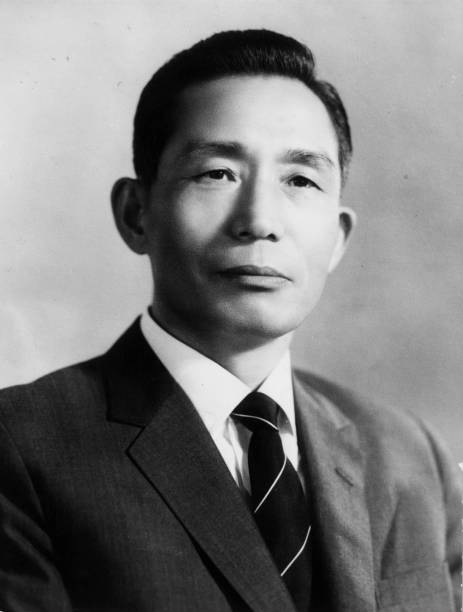
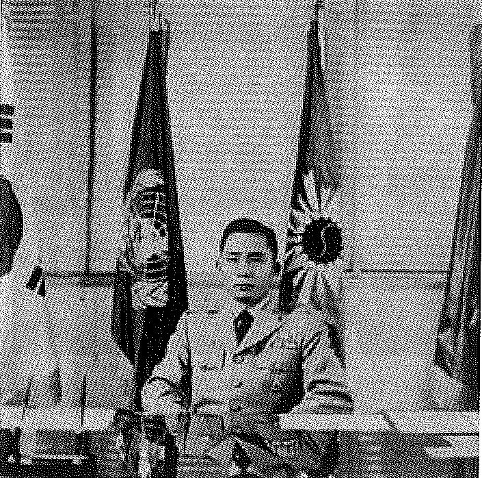

我在想我老公是學啥的，我知道他是傳統職業者，可是我是一個技術NERD，我們沒有什麽共同話題哎，我做游戲，他能幹啥，V我200讓我充值CHATGPT PLUS嗎，還是讓我放心發表，沒人敢查我，不能幫我寫代碼那我無話可説，人家最崇拜會搗鼓web3的男人。

我和王專業的對話：
我：溥儀比張學良聰明多了。張學良甚至害怕溥儀，溥儀完全沒有實權。溥儀被關東軍擄走，就是打著張學良要暗殺溥儀的旗子，因為關東軍恐嚇溥儀的炸彈是張學良兵工廠的。張學良170公分，溥儀175公分。九一八之後還能喜歡張學良的你，是好樣的。張學良不是對女人好，只是太軟弱了，所以比起大男子看起來很尊重女性。大帥他怕，老帥他怕，漢奸都怕，溥儀他也怕，蔣介石他也怕，共產黨他也怕，蘇聯也怕。他一輩子唯一兩次硬剛：中東路事件，把蘇聯人得罪了，你看看他這腦子，關東軍比蘇聯人好惹多了。而且蘇聯人也不喜歡關東軍，明明可以用蘇聯人對抗關東軍的。再就是西安事變，愛國？他是打小日本了，還是打蘇聯人了？連周恩來他都怕，哎，東北軍是吃乾飯的。他咋溥儀都怕？溥儀是真的被架空了，但是溥儀這個人很有能力其實。溥儀真的。溥儀這個人還是有點腦子的。

王專業：“你覺得他要是坐光緒的位置，能從慈禧手裡奪權不？賽博鬥蛐蛐”
我説：“不能。慈禧。晚清政治。我覺得玩的牛逼的不是一點半點，張作霖估計都玩不過。我剛剛從學校下
課，剛剛教練問我是不是上課不想上了？因為我突然冷笑了一下，因為我在聽溥儀。日本人打仗這麼多年，大部分資源都是東北來的，少帥給日本人留大大的了一個金庫，幹得好啊！什麼石油了、鋼鐵了、黃金了、白金了、白銀了，還有大量的糧食出產，少帥幹得好啊！日本人的兒皇帝：A.溥儀 B.熙洽 C.張景慧 D.張學良。如果說日本人就是比較強，所以國軍早期節節敗退，那麼大部頭的責任都在張學良的神助攻上。張學良可笑就可笑在，他老爸的親信他是一個都沒籠絡。日本人籠絡了好多張作霖原來的親信。你說東北的地產資源帶不走就算了吧，他把兵工廠好好的，全部留給日本人了。一般撤退大後方都是要把這些帶不走的全砸掉的。虛假的漢奸頭子：溥儀。真正的漢奸頭子：張學良。因為我在聽宣統皇帝的講座，後面講到偽滿洲國，聽得我，真把我聽笑了。張學良把自己所有的能用的親信也好、老帥也好、還有各種各樣能拉攏的各方勢力全部送給日本人了。我覺得也不是沒有人不愿意出頭，只是愿意出頭的，全讓張學良早期砍了頭。連張作霖的拜把子兄弟都讓日本人籠絡走了，你不覺得這很可笑嗎？太他媽神人了！張作霖是忠心的前清遺老。溥儀受民國政府的惡意對待的時候，像胡適啊之類的，他們說話都不管用，因為他們只是文人。張作霖就帶著東北軍直達天津了。溥儀還向張作霖求助。到了張學良這一代，關東軍直接他媽給張學良背黑鍋。不知道的以為這倆是他媽仇人。你的意思是？張作霖一死，趙五娘幫著張學良上位。你的意思是東北軍一下子實力減到1/3了是嗎？那麼張學良的行為真的是可以接受，但是，，，一般的這些民國大佬，比如說我們講到戴笠就會想到杜月笙，他倆拜把子兄弟；想到蔣介石就會扯一嘴宋子文，宋子文是宋美齡的弟弟、財政部的部長。不知道的以為他是順治帝，說實話，你要是東北王二代，你別說找一個趙四了，你找趙四五六都行。順治帝在董鄂氏離世之後就上山出家了，權力交接很平穩，把事情處理清楚了就走了。說張學良是很風流的那種類型，我尋思你要是東北王二代，你有個二十個姨太太有啥奇怪的？你要是那麼多人，現在就只忠心一個人，那能叫一個風流？他只是LKD而已。他弟弟去當共產黨，他爸的拜把子兄弟去當漢奸，老帥（指張作霖的舊部或親信）全部被他砍死。原生家庭的破碎這一塊，二創我是不會把它做成梟雄的，我不會給他洗白一點點。如果還有人玩了這遊戲，能對這傻逼有好感，那也是神人了。

我打算把這個做完之後，再做一個民主三部曲，紀念一下這仨：李光耀、朴正熙、蔣經國，亞洲政治界大佬。我是朴正熙夢女，其實我覺得他挺帥的，他說話我也愛聽。絕對實用主義的中層精英，悲傷絕望的雙面軍人政客，背棄父親的傳統官僚二代，很帶感吧！他有一句名言：「我不想再有我這樣可悲的軍人出現在這個國家。」就這一句話，我真的！這個就是純粹的視覺小說，通過不斷地交互了解台灣、韓國、新加坡的民主歷史。

真正的爭議性人物：鐵腕獨裁軍人政治家朴正熙；虛假的爭議性人物：張學良。朴正熙是真草根，農民之子，去當日本軍人，日本倒台跑路韓國。他上台是篡權，他下台是被暗殺。他得為名不正、言不順，走的也是名不正、言不順。在位期間獨裁統治，大權獨攬，極端的程序不正義，但是一舉之下把韓國的經濟搞起來了，就是路是歪的，但是硬走對了。

李光耀是面子上說民主，但是他是絕對的精英政治的興奮者、信奉者，其實他骨子裡还是很相信納粹的那一套優生學。但是現在都把新加坡叫民主國家。李光耀在位期間打著民主的旗幟搞個獨裁，他下台的時候把他李氏家族的人全帶走了，把權力交接弄得特別和平。

蔣經國，他爸獨裁者，沒的話說，算是違背祖宗的一個決定。而且對於台灣來說，他才是外來貨。但是就在他這一代，在一個獨裁者的家庭中，出現了一個民主先鋒。其實張學良是想做蔣經國這種人，接下老爹的獨裁大權統領的政治資本，然後從政治上反對老爹，否定父權，搞西方那一套，但是他做了一坨屎啊！

大部分二代幻想自己是蔣經國，實際上實操起來變成了張學良。

朴正熙他在日本叫高木正雄，因為朴正熙人長得比較帥，所以我打算直接用AI轉化他的照片做立繪，像一些對話可以直接導入他本人的語音。同時期我們還在「大海航行靠舵手」，女主角是作為他們的地下情人出現的，沒有立繪。第一人稱對話式了解三個政治家，

我想先做個蔣經國系列作爲張學良系列的姊妹篇，後面再做朴正熙和李光耀，作爲雙子篇。

李光耀：絕對實用主義的中層精英

「實用主義」是李光耀的根本信仰。他毫不在意民主與自由的道德高地，只在意效能與穩定性。
「中層精英」尤其準,他不是貴族，也不是草根，而是靠教育升級的殖民地精英，他看不起基層，也不盲從貴族（反感馬來皇室、懷疑人民自決能力），最信任的是和他一樣受英美教育、理性計算的管理菁英。

「法律制度就是精英管理的架構圖。」
「我的民主，是一種有稽核的信任。」

朴正熙：悲傷絕望的雙面軍人政客!

「悲傷」：農民出身，國仇家恨、歷史輪迴的悲劇感，他不是權貴，是被戰敗帝國（日本、朝鮮）碾碎過的破碎人。「絕望」：他不相信民主能拯救韓國（朝鮮戰爭給他灌輸了這種世界觀），只能靠軍人與中央集權。「雙面」：他既是日本帝國遺民，又是韓國民族主義者；既是救國者，又是壓迫者。

「一切溫和的努力，都死在戰場上。」
「我不是選擇強權，而是別無選擇。」

蔣經國：背棄父親的傳統官僚二代

「背棄父親」：是這個角色的最大戲劇張力。他從小就是以“接班人”方式被培養，卻走上了結束父政權的道路。「傳統官僚」：蔣介石集軍政大權於一身，是一個戰時威權國家的最高統帥，但也是舊式士大夫加軍閥混合的統治者。蔣經國一開始執行的是最鐵血的特務政治（雷震案、白色恐怖），到晚年卻成為開放黨禁、報禁、解除戒嚴的象徵性人物。

「協和萬邦，天下為公。」
「當我站在自由前面，我父親站在我背後。」

我的游戲只是自娛自樂，近現代政治系列，張學良和蔣經國是雙子篇，朴正熙和李光耀是姊妹篇，操！不能發在主流平臺，還不能變現

草泥馬的Xmind，老子用VScode做思維導圖！