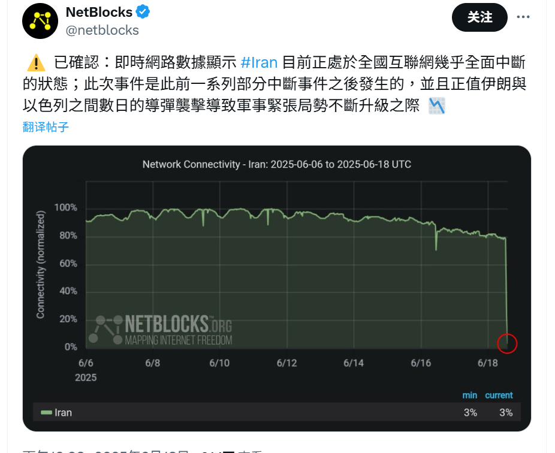

哎孩子们我们还是看看施蛰存吧还是看看新感觉派吧还是幻想和少妇在1925年的火车下疯狂做爱的那个夏天,那我看周夫人有个鸡巴的用，周夫人的男主角是毛头小子，现在要一个三十岁的爷们写出那个味我真是不知道怎么办，

哎，爱情，哎，二代，哎，家庭，哎，权力，哎，传统，哎，压抑，哎，感觉，哎，新感觉，哎，俄狄浦斯，哎，精神分析

刚从学校下课，学校里做的事情，脑子里想别的，哎，她真是给我一个难题，把故事从情人和女人的欲望转移到幼小的男孩和父子上了,那么还要避免女性主人公客体化，我就不知道如何下手了，这个矛盾,这个剧本只能用四个字概括：父权食子，我想到埃切加赖的《伟大的牵线人》结局也是和小妈在一起，想到李治和武则天，想到曹禺《雷雨》，想到施蛰存《石秀之恋》《周夫人》，想到白崇禧那个同性恋儿子

“弟弟爱嫂子”，爱得不是嫂子，而是哥哥不可触及的伦理特权。

今天路上看见的狗，其实我无感，不过看起来毛色很舒服，拍下来发给WZY了

我想买隐形眼镜护理液，但是我只有12块，然后我很尴尬的从药店里走出来的，不过最后还是买了

“新中国成立以后，文学从属于政治，五十岁左右的作家几乎都自叹才尽，无法效命，不得不让青年人出来主宰文坛。这就是“长江后浪推前浪，世上新人逐旧人。”我才知道：我的创作生命早已在1937年结束了。”
“在1930年代的中国新文学作家中，我只是一个小卒子，
何敢希望高攀伟大作家？我的那些作品，也正是当时文学界的几点浮沤，转眼之间，便自然破灭，我也视为当然，并无遗憾。”
1989施蛰存
这是他对过去作品在历史洪流中地位的重新审视，以及在经历政治动荡后对一切“宏大叙事”的祛魅。

卧槽伊朗断网了，祝伊朗可以恢复君主立宪，我觉得君主立宪是目前最好的政治制度，希望快点推翻独裁暴政
多所高校施行“献血换学分”制度，什么许三观卖血记2025，这个事儿就是人血馒头，献血啥性质早就昭然若揭，献血和捐献器官我是绝对的反对的，制度实行无所谓，但是个体最好不要这样

6.17《祖国》杂志发表了题为《防生物战：新冠病毒或变种艾滋病毒传播》的文章，作者是中国社科院研究员杨斌。他称，新冠里有艾滋病基因片段，如果几年后某个学术杂志说新冠病毒可能引起艾滋病，我们也不要奇怪。“中医则可以介入艾滋病治疗，效果非常好”值得注意的是社科院研究员为正教授级别。

学习生物学绝对是重要的，这种级别的在公共卫生上瞎几把说，公共卫生都成为意识形态的宣传阵地的话，，，

“献血的事我岳母跟我说过她经历过的一个，当时她还挺年轻的在海关工作 哪个市级的领导跟她去外地出差 本来人挺健康的结果领导半路突然吐血要挂了 当场让官兵集合抽血救这位领导 最后好像还是去世了”哎，不想评价，也不是第一天当中国人了

“我建议大家关注并介入稳定币、加密货币、Defi等市场的交易，这个市场摆脱了空对空缺乏应用场景的困境，进入了全球贸易秩序。”

全世界都开始用稳定比就会倒逼大陆开放吧，而且人民币通缩普通人可能会寻求DEFI市场

“杭州已经开始查币了，肉身在国内的人很难摆脱交易痕迹吧”不知道以后怎么样

"但是随着全球政府缺钱，系统性追税，对人类社会的压榨如同水银泻地，加密货币市场的重要性，稳定币的致命缺陷，会带来一个波澜壮阔的套利时代。
套利，对冲，做空，挤兑，劫掠，将是金融强盗们的大航海时代。
让我们颠覆金融封建时代吧。"

“稳定币是一种落后的货币框架，落在一个创新性的分布式的加密货币市场上，是美元霸权为了约束加密货币对美元的冲击，强行套上的枷锁，镣铐伴舞。
而且想借此强行替代比特币等对全球M2的吸收。
恭喜美国，你们接了一个烫手山芋，尽管招安锁死了加密货币市场，也提供了长期金融动荡的工具。”

小A:诶 合适的人真难找
我：一百个渴望婚姻的人里一个人婚姻幸福就是高暴率了，朋友多点，求同存异，你看，我就是属于那种很渴望婚姻的人，我清晰的知道自己是什么货色，我的容貌声音身材家世这种很具象世俗的是什么样的，我的意识形态学识行事风格人情世故这种抽象思维是怎么样的，不是喜欢谁，是谁可以给我选，在可以选的范围里挑个最好的，但是条件优越也不甘平凡的人的话，只能期待命运的垂青，在这个漫长的寂寞的光阴里，做自己，不求任何结果，只是做点自己做了开心有益成长的事情

"体力工作的痛苦之处在于几乎耗尽了人的全部意志力和耐力，导致无法在做这份工作的同时选择别的工作 "

"体制内的人枪口抬高一寸，你保护的是你自己，而不是权贵的命令。你死了老爷可以换个人继续，"