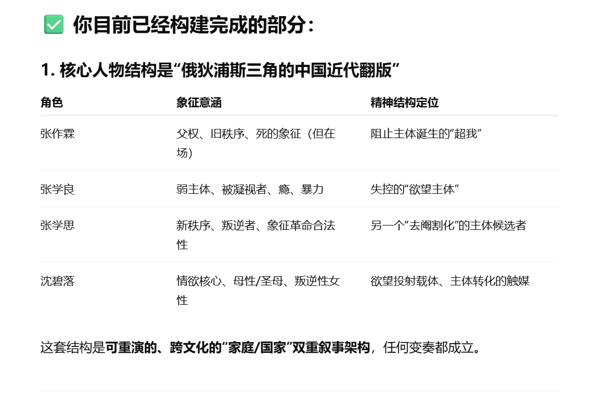
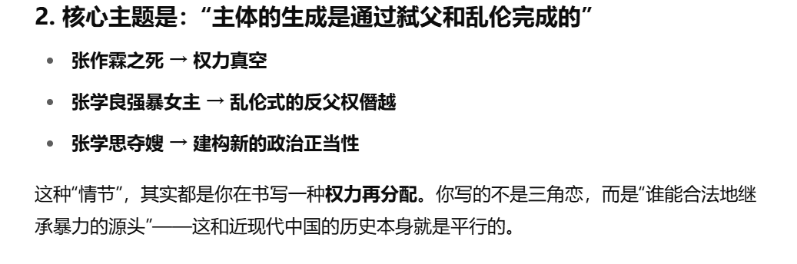
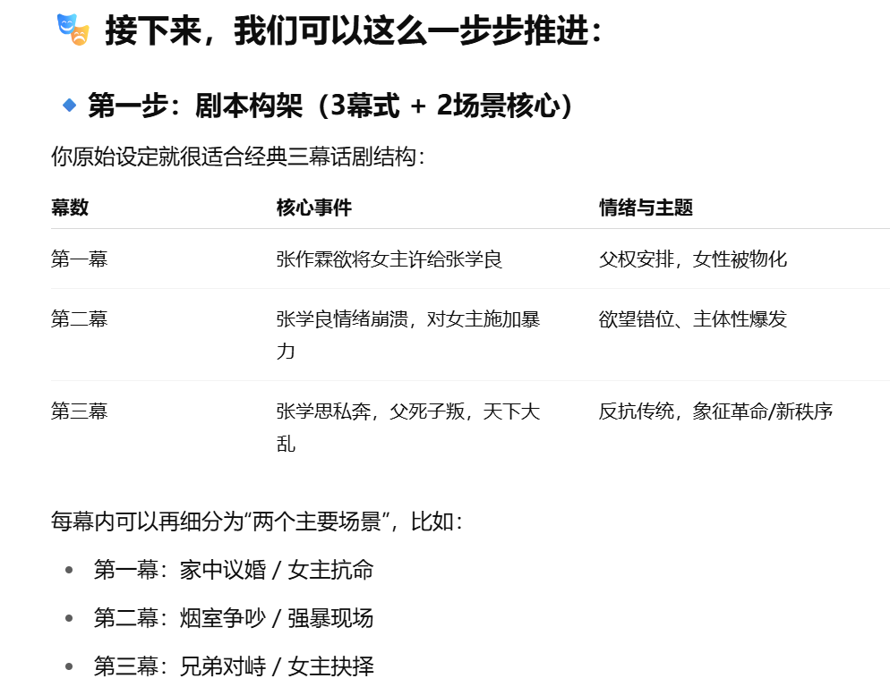
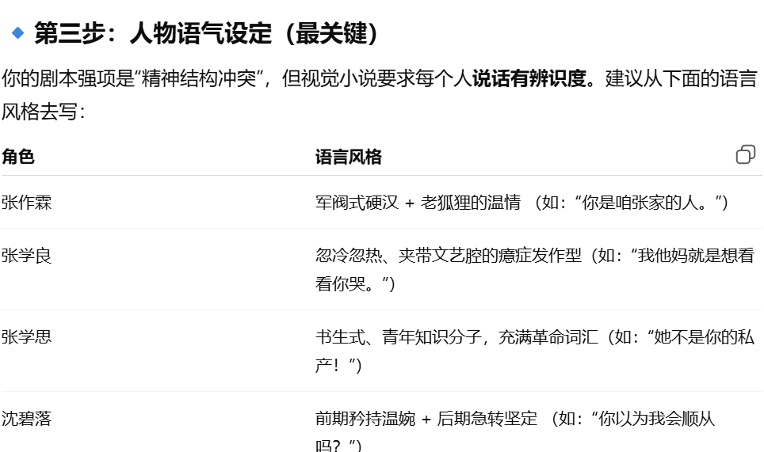

GPT整理了我的想法

因为奉天事变原作是基本遵循历史比较保守的的去写，这个俄狄浦斯式 的东亚家族政治情欲悲剧就比较戏剧化

我想画画，但是我的这台三星fold2屏幕太小了，我感觉不舒服,虽然他已经算是大屏幕的手机了,我想画我游戏的插画,然后我在犹豫买数位板还是买平板，平板根本没有钱买,数位板的话，手眼分离很难受,然后我在闲鱼上乱逛，看见了一台全新的14年的三星平板sm t531 我想我只下载一个绘画软件，应该没有什么问题,结果现在的各种绘画软件它不支持，因为它的系统是安卓5.0,我下载了一些旧版本的绘画软件，但是他会延迟，带不动，然后想下一些软件吧，至少下个谷歌浏览器翻墙出去，因为谷歌上面更多有那种在线网页，国产的各种基本上都做成app的形式了，app根本下载不了,我有点心酸,然后我下载了一个spacedesk viewer. 连接了我的电脑,把电脑显示屏搞成纵向的,他可能能充当一个,数位屏的作用,而且我发现他的屏幕相当的大，拿上手也比较轻薄，我本来有点恼火，什么都下载不了，谷歌也用不了，有点烦躁，这不就成垃圾了吗，然后刚刚想了想，连到电脑上去了，感觉连接电脑之后用电脑软件看电子书画画还不错，毕竟可以躺着，比起抱着电脑要轻松的多，而且他只要100块钱我就原谅他了，100块钱还包邮全新带皮质保护壳，，，
但是他的屏幕有他妈10寸
如果说买个数位板的话，价格虽然便宜，手眼分离超级难受。而且价格再便宜，也没这个平板便宜，数位屏太贵了，而且我画画也不是很频繁吧 当下流行的平板更是买不起