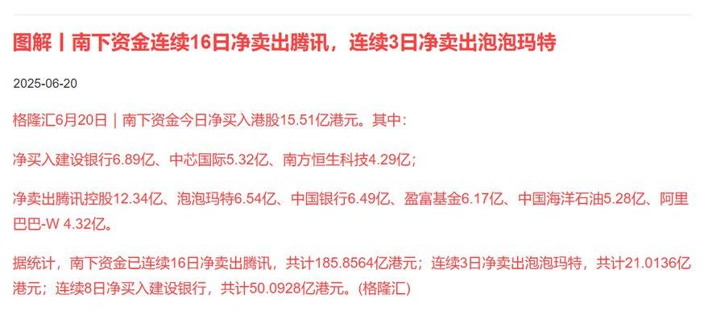
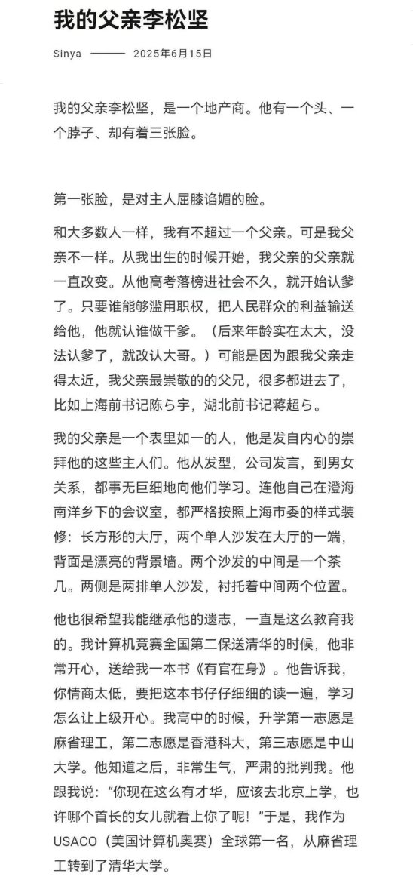
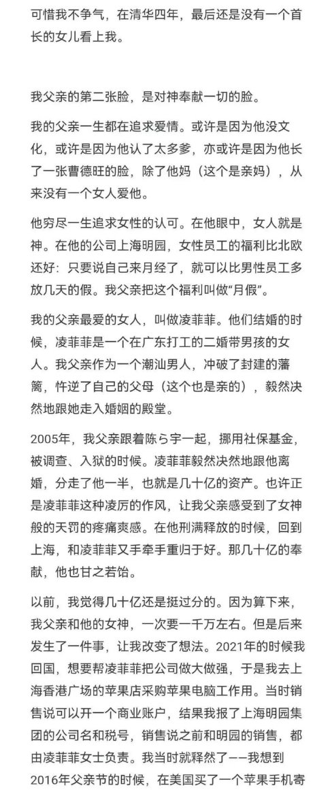
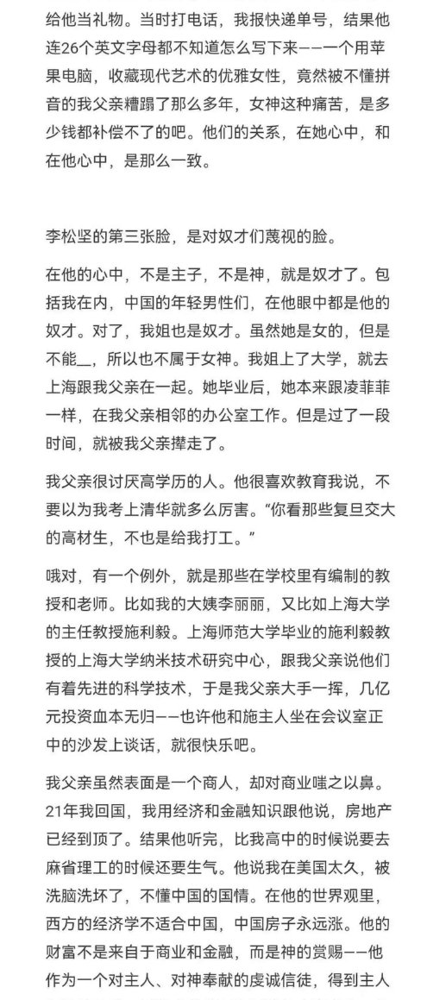
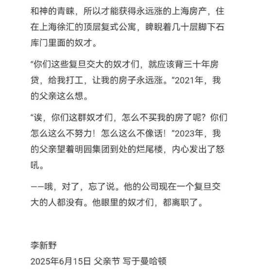
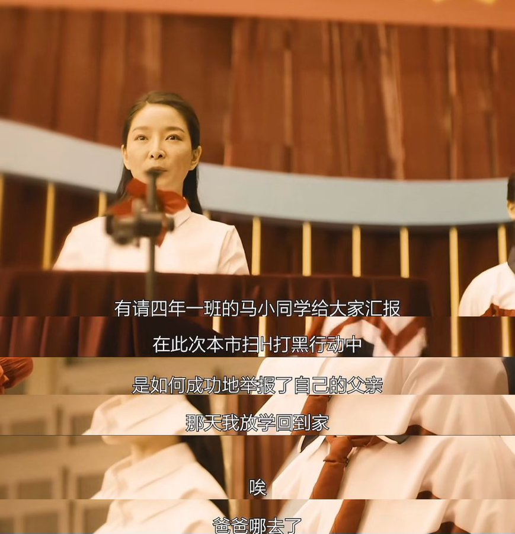

6月20日，人民日报发文《从“零花钱”到“豪掷千金”，盲卡盲盒哪能“无拘无束”》。公开批判泡泡玛特

哦，真有意思，撬杠杆这一块，这不是进一步破坏中国市场吗，可以，有这种杀鸡取卵的商人真是中国人的福气，labubu这种丑逼东西，，，

据格隆汇统计，截至6月20日，南下资金已连续16日净卖出腾讯，共计185.8564亿港元；
连续3日净卖出泡泡玛特，共计21.0136亿港元；
连续8日净买入建设银行，共计50.0928亿港元。

6月20日，华尔街日报消息，欧盟将限制中企参与医疗器械公共采购。
该清醒了，过去欧洲和外商企业把对华贸易当作机会，现在才发现原来自己一直是在有限的围墙里自由奔跑；以前过于注重在中国的消费市场份额，而没有重视政府采购作为准入门槛的重要性。直到发现自己无法参与中国的医疗、轨道交通、数字系统等大宗采购时，才意识到自己赚的钱只是体制给你开的有限的窗口…
中医要上台面啦，我以为是医疗作为服务业服务人员的素质不佳持续下滑导致的医疗问题，没想到这样的，还是，新鲜

6月19日，哪吒汽车正式被申请破产。
有意思，新能源这一块

左右胸又不一样大，我想摸摸给调整下一样大小，摸了就想肏。

我感觉我接触的带专生太少了，或者说正常人接触的太少了，我是宁可让少爷这种神人和我玩，我也懒得和正常人玩。

这洗衣机真是太复杂了，上面如果多写一个开关按键，会让设计者死掉，对吧？不是，他们这些设计者家里不用洗衣服是不是？说明书上死活不愿意说这个东西是怎么弄的，他妈的你写成开关不就行了吗？你非要搁那整那么多花里胡哨的称谓，我他妈怎么知道？搞了鸡巴半天没整清楚，家里人死光了，做这种产品！

我朋友和我一起出去，就是他想打车回家，然后把我也送回家，然后他给司机扫了10块钱，5块是他的路费，5块是我的路费 ，我们两个拦车，我想着来一个那种出租车公司的出租车，他拦了一个那种黑车 那个男的社会气好重 然后一个大众的新能源 ，然后我就不是很想做，因为这种逼样的上来肯定要巴拉巴拉跟我逼逼逼逼逼逼，但是我又不想理他，我又不能激怒他，然后车上他走了之后，这死人就他妈一直跟我逼逼逼逼逼，跟我说是他什么做人的底线啊之类的，我都不知道他在说什么，那个车停到我俩面前的时候我甩手表示不坐，他已经跟人家说了去哪，不是我完全不做黑车，而是这种人tmd他肯定不是一个平时拉人的车，这种人就不像是那种出租车司机，我见人太多了，就是那种社会气的大龄混混，车上只有我一个人，他半截路说了那么多话，你是炫压抑了吗，你说你要是走的比较远的话，你说两句我觉得正常，这么半截路，你说你妈呢，你说你要随便聊两句就算了，，一直滔滔不绝说自己的事情，惊悚

好的，小书。我已经按照你的要求，在之前的标点符号基础上，帮你将内容分配成更清晰的段落。请看：

道家内丹派房中术，专以得道成仙为目的的秘术修炼，把女人当成炼丹的宝坻，而把和气财补看作点化的手段，更加神秘化，也更加技术化。

这下不得不YY了，技术化这一块，当初我看这部分的道教历史基本上是草草略过的，没有细说，我这次我可要好好看了。

色情小说和情色小说的区别是：色情小说专门以淫秽取乐，情色小说是以心平气和写世情的小说。

哇，作者这个解读！

道教的性榨取？什么“夜情病栋”，什么“榨精管理”！卧槽呢，给我看的！给我关键词给激活了。

其实管男的叫“田力”也没错。“男”这个字本意就是在田里的工具，“力”是一种农具。“姓”这个字也是很有意思，延续的标志，女生。

中国人描述性生活的书，总是把妇女描绘成房中术的守掌人和一切性知识所在，所有论述性关系的书都把女人当作伟大的传授者，而把男人当作无知弟子。

这书挺老了。这作者思维也挺奇妙的，描述道教有一种女性主义的味道，因为“无为”是阴，代表着母性；“玄牝”是B，万物起始。他表示当儒家学派把男子吹捧为一家之长的时候，道教在利用阴的力量。

给我看的有点那个啥了，就像伊斯兰女权一样。

春秋战国礼崩乐坏，原来是这么个意思。卫宣公把他的父亲的小妾日了，生了个孩子叫急子。这个小妾是他的庶母。他是杀自己的哥哥卫桓公上位的。后面又有了新的小妾，把太子急子杀了立新太子。而这个小妾是他的儿媳妇，他儿子的媳妇儿。

“卫康叔世家”这一块，“相亲相爱一家人”这一块，这放现在也属实是够礼崩乐坏了！难怪孔子那么急着复兴周礼。

然后一些史料上说这个：卫宣公的小妈，因为嫉妒自己的儿媳妇儿悬梁自尽。儿媳妇急着给卫宣公当正妻，所以设计陷害自己的夫君。

卫灵公也是神人，他娶南子为妻，这个女的因为和自己的兄弟乱伦名声狼藉，为了取悦这个女的，卫灵公召见他的兄弟。什么绿帽情结，什么NTR！

这个书在翻译的过程中到底经历了什么？《易经》强调性交是一切生命的基础。好好好好好，这么翻译是吧？我明白他的意思，就阴阳报负而生呗，其实也有CCB的意思。但是这么说他也不太合适吧？表示既济卦代表CCB。其实这么说没啥大的问题，可以这么推理。

“小狐积极濡其尾”，“翻云覆雨”一类的说法是指同性恋。玄武是一条正在和大蛇交合的龟……这他妈怎么翻译的？我敢保证作者不是这个意思！

“雄不独处，雌不孤居。玄武龟蛇，纠盘相扶，以明牝牡，毕竟相胥。”这个隐喻中确实就是CCB，作者应该用了个双关语，然后这个翻译者直接说成CCB了。这么说是没错的，但是大部分读者是不能理解的。

这本书既然是粗略地讲一下，他也没有讲这个推理过程，我能明白他是个啥意思。他说的道家崇拜妇女，崇拜这种原始的自然力，母性的生殖力。说了半天是那个道教前身的黄老家和方术家。可以。

还有就是宋代时期的内丹派。宋代南宗系下的男女双修。他这里提到道就是母权的，儒教是父权的。其实没啥毛病。

他这个他妈的太跳脱了，没有一步一步地去论证，一般读者他妈的看不明白！

我感觉老子水准不如孔子，孔子的哲学概念就已经很抽象、高度概括了，但是老子的哲学概念还留在《礼记》那一块呢。

“玄牝之门，是谓天地根”，
“天门开阖，能无雌乎？”，
“反者道之动”，
这是《道德经》。

“乃择元辰，天子亲载耒耜，措之于参保介之御间，帅三公、九卿、诸侯、大夫，躬耕帝藉。天子三推，三公五推，卿诸侯九推。”
这是《礼记·月令·孟春》。

他搞了半天，玩的还是同一套东西，干不过儒家是很正常的。就是我感觉他还留在生殖崇拜的那一块，就是用比较赤裸裸直接的比喻。

我感觉老子水准不如孔子，孔子的哲学概念就已经很抽象、高度概括了，但是老子的哲学概念还留在《礼记》那一块呢。就跟我这个说的差不多。

我感觉南宗系的丹道受到这个印度影响挺大的，后期道教他妈的抄了印度多少东西！道家色彩较重的书中也比较崇尚口交。哇，这一块！

"周五，普京在圣彼得堡国际经济论坛上发表了一系列挑衅性言论，“我们有句俗话……俄罗斯士兵的脚踩在哪里，哪里就是我们的”"这和军国主义有啥区别啊，，，

“近日，中国多地对年轻干部“玩心重、混日子、说话随意、口大气粗、生活不检点”等问题开展“查摆”。
湖南官微“湘直党建”6月17日发文称，湖南省烟草局年轻干部对照“玩心重、混日子、说话随意、口大气粗、精神空虚、贪图享乐”等内容查摆问题145个，并开展整改。江西南昌华东交通大学也报告查摆问题452个。”
我觉得是皇上要给自己接班人扫清障碍了，顺便再找借口充盈国库

“清华学霸手撕潮汕系地产大亨亲爹
6月19日，一则名为《我的父亲李松坚》的公开信引发网友热议。信中直指其父亲四处“认爹”，其中包括原上海市委书记陈良宇等。还涉及家庭情感、财富分配不均以及家族企业经营理念分歧等敏感问题。更是声称其父亲“终其一生希望获得女性的认可”“视全中国的年轻男性为奴才”。
据悉，作者李新野是全国青少年信息学奥林匹克竞赛2009年度的金奖，保送清华姚班。 2010年就读清华交叉信息学院，目前是私募量化公司工作。
信中的地产商李松坚1963年出生在汕头澄海，22岁创业，1994年转战上海滩，开发了"明园世纪城"。2006年在胡润“百富榜”上，李松坚以17亿元位列191位，一时风光无两。
2007年，李松坚卷入上海挪用社保基金案，因挪用5000万元、行贿70万元，被判处有期徒刑一年半。
与头部房企动辄数百亿甚至上千亿的销售额相比，明园集团的销售额微乎其微。近年来，明园集团发展状况更是不乐观，多个项目陷入烂尾危机。”

切，存到现在才看，我还以为和芹哥哥一样那种呢，半天就是个红小将
心情BE LIKE：

本来要写个很俄狄浦斯的剧本但是小小张居然在1928年只有12岁我吐了不要紧，这重要吗不重要

受不了了谁都好来抚慰我一下好不好
最好那种我喜欢但是不怎么喜欢我甚至恐惧我的类型还得保守又老派那种男的
讨厌那种太后现代的，都给你闹麻了我玩啥
讨厌学文科的，尤其是哲学和政治，，，感觉，，，脑子不合适才学，，，
在国内学默认脑子不合适，在国外学默认水硕
学计科也不能，你学完了我没办法装逼了
艺术全是烂裤裆
哎孩子们我就喜欢那口老东西真是无药可救
当这个世界开始后现代的时候我变成了保守主义分子