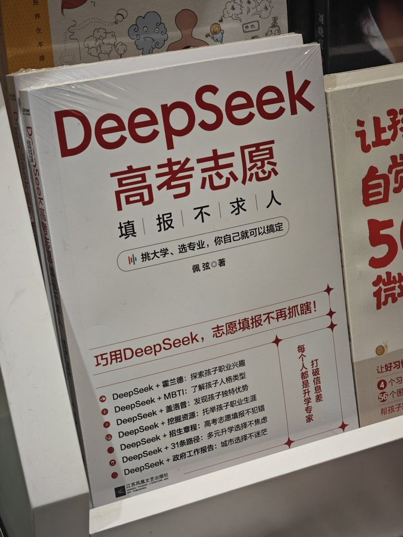

。

我觉得太痛苦了，这八年，就是恍惚一下，黄粱一梦一样，十二岁之前的我好像一块铁，各种各样的压迫，还有煎熬，锻打我，淬火，百炼成钢，终于用血泪淬火打出我这把宝剑，只是还差出鞘，宝剑出鞘之日，定要有人血祭此剑

我觉得我有个很严重的问题，就是想的太长远，忽视了当下的细小的危险性，总是在不断的未雨绸缪。没错，我对宏观社会环境的把握是十分精准的，但是我的个体生命里的一次次小小的错误将会毁掉我对社会发展的适应性。就好像我总想怎么去把大学时间利用起来发展副业或者把我这个专业发展成可持续发展的一门本事，实际上我没有实际考察过当地，还有种种。我应该首先规划我接下来的科目一考试。

吊桥效应和爱情是两回事，可是没有这种效应真的会有爱情吗

真恶心，人一辈子就是不断的陪笑，陪笑能换取利益为什么不直接当三陪小姐

觉得好迷茫，做独立开发以及海外公司外包的远程办公，还有就是进厂上班，或者我就老本行继续发挥个人魅力整的和传销一样让他们付费享受和我说话的乐趣

怎么都想把我敲骨吸髓啊

不行了我得打破信息差了，我踏马常年和这些死人技术佬搅在一起，不行我得想点别的，所以你的意思是我把JS，PYTHON，JAVA都拿捏住了？我尼玛，对。我优先把JAVA和PYTHON搞定吧

