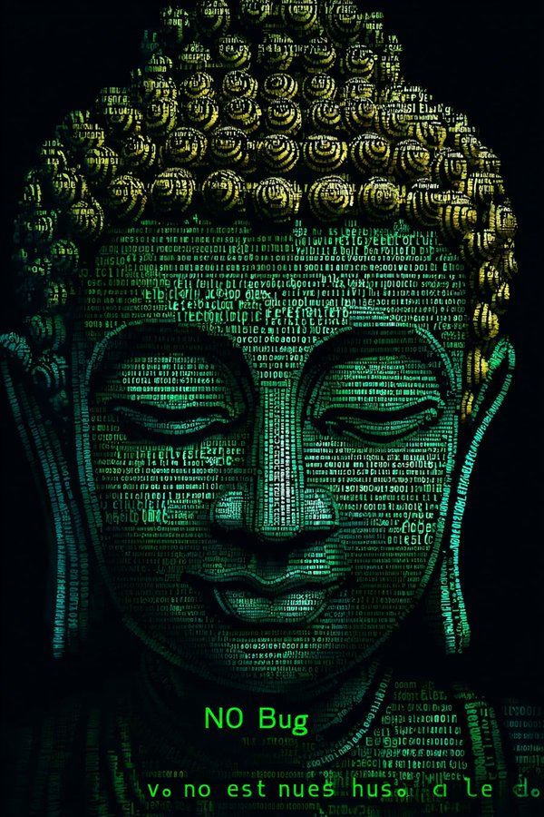

我驲尼玛的，我说我怎么爱看白先勇写的书，大家都是可悲的性少数啊。我好想哭。那时候我和少爷说我发现我是跨性别的时候，我一下子获得了心理的安心，我感觉下身长着女性生殖器官还有巨大的乳房让我很焦躁，我需要用女性的肉体获得一些好处，不管是外表的称赞还是更多关爱都好，能很好的缓解我的焦虑，其实我一个人的时候我压根不会像女孩子一样说话穿衣服仪态表现。哎我都不好意思和跨儿混在一起，我不够亚文化，我不够有勇气对抗世俗，我只是想装好顺直女，我不嗑药我不吃激素我也不滥交甚至我都不抽烟喝酒，我和他们混不到一起，，，哎我好难受啊我其实不是顺直我踏马是跨男啊我操谁来帮我调理调理。哎别人觉得我不像跨儿，我也想潇潇洒洒的出柜啊，可是没有办法，我没有太多的资本，我只能努力的假装自己是一个合格的女人，我装女人装的很好是因为社会对女人的标准是按照男人的视角出发的，我是一个男人啊，我没有勇气出柜的，换句话来说我也觉得当女孩没什么不好的，可是总感觉怪怪的，这是为什么？

请原谅我～像风一样的男子～ 哎我的心情就是很奇怪马上要跑出来什么了，，，一会我是风一样的男子我一会越吻越伤心了，我真是我要精神分裂了，好吧我这会可能文艺病发作了。

好吧我觉得我就是一个被夺舍的状态，一会是男人一会是女人，一会是同性恋一会是顺直人。我感觉白崇禧来索命了。军阀把我这辈子害死了。但是我还是有点汗流浃背，这也太吊诡了。原来姹紫嫣红开遍，都付予断井颓垣。他是怎么样心理，我感觉我能理解，但是去理解他一定是要直视我内心的羞耻和创伤的裂隙，所以我都有点汗流浃背呢，我到底要不要跑，我感觉我心理有点奇怪就是，这会被白崇禧夺舍了。就是那个谁也是研究昆曲剧本的大拿，哎看他写的我有点汗流浃背，原来，我，就是怎么说呢，原来姹紫嫣红开遍，都付予断井颓垣，说的是古典时代的闺中小姐内心自白，然后那个谁一个男的也这个心态，你妈了个巴子你老爹是牛逼的军阀头子你搁这在别扭啥，好吧男同性恋这一块，害得我心理现在。就是我心里就像一个军方高层赋予厚望却发现自己是男同性恋还有传统的阴柔属性的军阀二代。我就，不好说吧。就是怎麼說呢，我還有點喜歡古典文化，我有點汗流浹背了，其實比起亞文化我更喜歡古典文化，在當下社會而言古典文化其實是比亞文化更加邊緣化的文化，硬要說我也是一個非常古板的人。其實繞了半天我的意思是，就是我這個古典話本看多了腦子不太合適，就是，嗯，好吧，額，嗯，啊，一種，不好評

做爱到底是有什么意思啊，，，我真不明白，对我来说我只是觉得做爱是一种义务，我会尽量服务对方，本身我是无感的，我更喜欢自己扣扣，整天和发情的公狗母狗一样缠着那到底是什么，很恶心啊，，，像那种INCEL一样，不好评。其实我觉得好色的男人是真的没有出息的，，，至少不能总想那种事情吧，，，生命力旺盛的人一定性欲旺盛，但是欲望是可以转化的，，，我看见那种女性自我矮化物化的，我就感觉这个世界真是有了，什么玩意会不断的继承奴隶意志，，，什么样的人才会把另一个人当做自己的世界中心啊，，，不管是男的还是女的，这种家伙都很恶心吧，，，我有点汗颜了。。。就是见多了实在是想吐，没有自己意志的家伙，，，

别给我推GitHub项目了，我尼玛只是来X发癫的，一直看这些大脑要爆炸了。

南无霸格佛
南无系统崩溃佛
南无内存溢出佛
南无改需求佛
南无未知错误佛
南无致命错误佛
南无屎山佛
南无无注释佛

反正我觉得那种理工技术岗出身中产都有点一言难尽，就是怎么说呢，怪怪的，思维比较固化，虽然很多那種很负责的类型，但是他却不知道自己在为什么负责，只是单纯的负责而已，少爷就是这样的一个人，所以我不太喜欢家庭出身一般的。

少爷的那份心换到别人身上，我想他怎么都会成功的，不能说幸福的家庭，只能说社会看来成功的家庭，他给我的负责，我自己完全可以做到，市场就是这样的，如果你比不过竞品就认命好啦，我说的负责他理解不了，可能吧，毕竟他没有经历我这样的痛苦和血泪，总之是个好男人？会有人觉得我不知足就不知足吧。他的负责并没有抗风险能力，他也没有想构建抗风险结构，或者说他也没有能力，所以我不要他。他禁不起社会结构重组过程中的一点风浪，看似我收入只有他一半，但是我因为足够深的人际网络，我不像他一样是原子人，中国社会就这样，光要技术真不行呀，他可以做比我更厉害的项目，但是我可以组织能人做项目。其实我真想不明白呢，人的感情那么复杂，其实我今天才意识到我也是对少爷有感情的，没感情我不会给他一次又一次的机会，他难道不知道我的性格吗，其实我是谁已经不重要了，他只是在追求他心里的幻影而已，我很痛啊，我是因为这件事感到很伤痛，但是我要戳破自己的幻想，唯一的办法就是和他待在一起。我们认识就是很戏剧性的，因为一个非常冷门的术语。他问我什么是爱，我说小王子里那种东西吧。这是我触动他。他触动我也是问了一个问题，问我为什么起个青霉素的名字。我给他看了《孽子》的那一段。我有点难受，身体疼，好像我们就那么悲剧。不过还好他性格没有那么刚烈。我觉得他不爱我，他只是被执念困住了，所以我接受不了，我一直想戳破他心理这个业障，可是越戳越厚。其实我还没明白不识庐山真面目的道理，爱啊责任啊，我搞不明白他是吃饱了撑的吗，可能我生命太枯干了，我见到他那挣扎的样子我也心疼，因为从人的角度出发，我没觉得这是幸福。

其实我想当个什么呢，别人只是看见我每天好像很有行动力，但是从来没想过为什么我会这样，更没有想过其实我忙忙碌碌只是为了消解焦虑，我只是想不断的感受我生命的存在感，我恐惧被边缘化，我多渴望成为一个中心的人，我时至今日我才明白我的心意，我一直是一个舞台中心的人啊。不管是女人还是男人，都围着我，在一个我的回音室里社交，我一直渴望建立一个平等的社群，但是无可奈何我只能成为社群的凝结核，那么我希望我可以在新的生活里拥有自己的党卫军，我只求在接下来两三年里，能有一批对我忠诚度极高的朋友，只要三十人就好了。哎交际花生涯，实在是悲苦，我私心我更喜欢一个人待着，而且我内心定位自己是技术佬，其实我压根不是，我压根不适合去捣鼓那些，业余玩玩还好最后真比不了名校出身，还是老实当交际花吧，如果你不让一个热爱技术又煽动能力极强的人去做他的技术岗，那么他就会选择变成下一个阿道夫。哎其实我发现我也是难逃身份大于本体的家伙，，，我会局限于学历了家世了，快速筛选他人，这种极端功利的思维其实并不利于我的成长，但是还好，我基本上没有什么机会如此审视他人，在我马上有机会之际我开始纠正我这个了。

哎性压抑的难受，我好想草男娘。我不喜欢真男娘，我喜欢那种二元性别分化模式荼毒极深的大男子直男。

他对我的感情实际上到底是什么？男人正位，蛇正位，房子逆位。

所以我讨厌太爱吃醋的家伙，，，怎么说呢，，，我怕明着吃醋消耗我的精神，更怕暗着吃醋压抑久了真的杀了我，就是真正意义上的剥夺我的生命，不管是社会意义的生命还是生物学意义的，，，少爷就是前者，青菜就是后者。青菜可爱的要死了要死了，他要是真的杀了我我心甘情愿呀，我爱他爱的要疯掉了，他要什么我都愿意。哎我感觉白先勇那个书把我一辈子害了。难道我心不疼吗，我和他在一起，我知道他不爱我，我知道他只是执念，他实际上无法承担起我生命的责任，我也渴望被深爱着，但是他不是那个可以托付的人，只能说望梅止渴吧。我能做的只有穿透幻想，但是我却无法控制自己的情感投射，我对他的依赖是真的，这段感情就是饮鸩止渴，所以我想方设法的把他踹走，他一次次回去了，最后一次实在也是接受现实了吧，再也没有回来。有时候我想这是我希望的吗，我最后会后悔吗，我觉得不会，实际上怎么可能呢，我舍不得又怎么样。我感觉他总是想有意无意的孤立我，彻底的让我生活在他的圈套里，但是不好意思呀，你这个少爷还不够格，你的圈套太小我不愿意放弃自由，我总觉得他想要我的命，我觉得他生气了真的会把我杀了吃肉喝血，我觉得他的爱把他变成疯子了，人就这么戏剧性？

王谢龙不管怎么样都留不住阿凤，最后在除夕的夜里杀人殉情了。我那时候看会觉得有些悲剧的边缘性美感，后面会觉得这傻B吧，哪个逆天写的。但是一想到这是真军阀儿子写的我没事了。

哎东东这个性压抑给我看的。长发男这一块，他当初在香港混不下去应该去日本，去当视觉系男主角吧。。。不过日本卷的要死。哎长发男除了郑伊健和陈晓东我一个都看不下去，都滚，装尼玛呢。什么是戏剧性的爱情张力？也许我是将风溶解在血中的男子，也许我是天生崇拜追逐，当你将疑虑装得若无其事，请原谅我，像风一样的男子。其实我也喜欢这种。。。但是不好意思呀亲爱的，我不是江浙沪独生女，我赌不起，我更不喜欢自轻自贱，所以我们只要成为friend就好啦。其实我就是这个心情，我会觉得很奇妙吧，所以我希望找个比我厉害的人，他有足够的资本让我在他的世界自由的飞，或者我能成为他的助燃剂。哎有没有那种很能反转的爱情剧本体验一下。哎哎，我就爱上你如此地轻佻，你又何必假仙故作清高，我就爱上你如此地轻佻，相信一切都是上天为我们安排好。哎《倩女幽魂》听的我春心荡漾，哎我再也不能这样了，我觉得这种机会实在是可遇不可求，还是把这种强烈的欲望指向创作出来吧！哎陈晓东长的符合我心意我真喜欢他声音。

我这个号本来是发我的吊诡情绪的，以后要发程序相关的了，，，还是再注册个新号？

就那麼看著高層軍二代王謝龍和強姦產物的孤兒阿鳳那個恨海情天，那時候少爺問我一个問題 我不想再提起，因為我會心碎，我會想到很多東西，就是像梅花外應一樣，我也真怕他像王謝龍一樣把我殺了，所以我一直也應該有畏懼吧

搞不明白搞不明白搞不明白，什么叫爱情的张力，好想写剧本，好想写剧本，电脑，电脑，来！哎誰听了我的愛情經驗都會絕望了，老子一輩子都是各種各樣的戲劇性，我尋思我的記憶里為什麼我和那些愛恨交加的對象們總是有一些“差距”，原來權力的倒置是張力的第一因