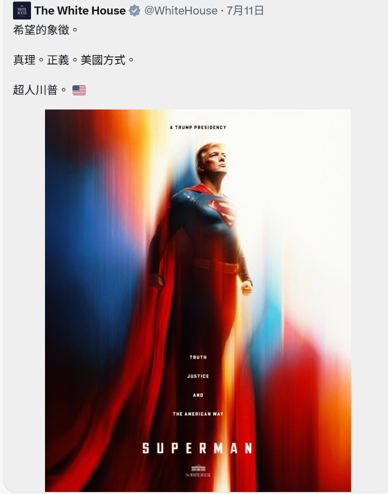

这些烂梗给我搞的，没绷住，正备级。。。。

哎圣奥古斯丁，他的一生我还蛮喜欢的，风流半生又捣鼓摩尼教，最后受福音成基督教圣徒了，比起阿奎那这种一生都是修士的，我觉得奥古斯丁更有意思吧，以前找对象可能就喜欢那种白纸一张，我现在感觉还得是那种风流的，因为风流的人才能真正的恪守不渝，经验面足够才有真正的选择呀，反正怎么说呢成就感，反正想不明白为什么有些男的那么自信喵，其实压根没人喜欢你，真的觉得自己是真的招人喜欢吗，不过是一群废物找到了一个世俗话语权具象化的载体而已，学历了家庭背景了，如果靠这种东西吸引人也可以叫魅力十足那我真是笑死了，男的就这么自信，底气真是自己给的吗我真是笑死了，好喜欢骂这些人爽的要死，少爷就这样被我恶心了那么久，也许我真的在pua他，我觉得其他女的都没脑子喜欢很廉价，我一想到我可能要这样对我下一个对象我真的笑死了，pua就pua呗，那咋了你情我愿周瑜打黄盖一个愿打一个愿挨男亲女爱，我的那种阴阳怪气皮笑肉不笑的样子其实也并不讨厌，长期观察其实也是可爱的地方，哈哈哈哈、、、

啊我昨天明白为什么我抗拒恋爱，因为恋爱中的男女关系是不平等的，我就会很不自在，如果一个男人把我看作女人，他就会自然的把我放在一个被征服的下位者的位置，我是一个被动的纳入的形象，我对于关系一直追求平等，既然我牺牲了我的一部分成为一个下位者，那么上位者总得真的有点荫蔽我的东西吧，反正我就是一个有点魔怔的家伙，我本来就不是女性，我在恋爱关系里就必须要接受女性的身份，我比起自然的状态更像是一种义务一样的表演吧，我很难把男性当做男性看啊，换句话来说我的心理不知道除去生理之后男女到底有什么不一样，很多东西就是文化塑造，为什么我非得接受这些东西的精神强暴，其实我也很享受当女孩子的感觉，当女孩子会让人更容易信任自己，当别人把我当做自己的知心的时候我就有莫大的快感，因为我们关系并不平等，我掌握了极大的话语权，啊真是极大的快感啊，不过更舒服的还是要那些社会中被当做人上人的家伙来提供，权力的倒置的快感实在是太强烈了，四两拨千斤的感觉。。。尤其是那些被当做模范的男人，他们对我流露出那种脆弱，我觉得冷冷的很舒服，在我们的二人世界里权力是倒置的，我具有更大话语权，也意味着他的资源一定是会向我倾斜的，这不是他主观想不想，人性如此，啊，想到这件事实在是，太舒服了，可是我觉得很可笑啊很可笑，凭什么觉得对方一定接受你呢呵呵，啊他们对着我流泪的时候，第一次我会感到诧异，我以为我做的不好把人家搞哭了，后来就变奇怪起来了，其实我并非无情啊，我们都是一种人啊，可悲的被剥夺了潸然泪下的权利的人，只不过我被剥夺的不仅仅是这些，我被迫成为了一个程序式的东西，只能对外界做出反应，内心却没有多少自发的感受啊，我要的可不是什么嘴上的说的平等，只有人性互认的那一刻，才有平等可言，所以我懒得和很多人搅，完全没必要,反正我就是一个有点魔怔的家伙，我本来就不是女性，我在恋爱关系里就必须要接受女性的身份，我比起自然的状态更像是一种义务一样的表演吧，我很难把男性当做男性看啊，换句话来说我的心理不知道除去生理之后男女到底有什么不一样，很多东西就是文化塑造，为什么我非得接受这些东西的精神强暴

啊今年就业这么困难，我其实也没吃过什么工作的苦，我更喜欢去一本万利撬杠杆，那种极低资金运转率的工作我不愿意干，耗费心力，这世上只要有有钱人，就有我的工作，有商业我永远不会饿死，前几天意识到我贩卖的是情绪价值和一手情报，我咬文嚼字和春秋笔法的技能拉满了，又可以提供各种我知晓的情报

突然意识到我是卖艺不卖身的鸡

其实我觉得我很棒啊，自己赚钱的日子里真的过的逍遥又快活

反正焦躁不安，因为我配得感不是很高，尤其是莫名其妙的被人家好，这才哪到哪我就已经如此不安

那我很贱了，我明白他们那个我不要很多很多钱我要很多很多爱的感觉了

有钱了不起啊我操尼玛，我好仇恨啊我好仇恨啊我，老子遭天谴了，这就是风流债的报应，我尼玛已经够收敛了吧，偏偏要在我穷的要去死的日子里出现一个对我还不错又愿意花钱偏偏就不愿意负责的主儿？那我去死好不好，我现在需要责任我需要责任，但是有钱拿我跑不了,那你很优秀了，我很羡慕你了😮‍💨就这样折磨我这样的可怜女人，那很不要脸了，我要是有钱我绝对不会顺从的

搞笑

美国真疯了