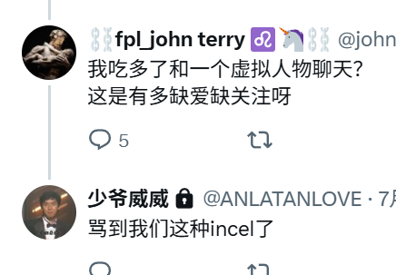

哎我想和你说我有点容貌焦虑，出门在外，大家都是身份大于本体的，先不论我的本体是怎么样的，就我的身份标签，我真的渴望别人多花一点时间了解我，哪怕一秒钟，所以我现在很在乎外表，但是我这个人的评价从外表到内里，全部是两极分化的，我不知道哪个声音才是对的，但是对我来说比我更强大的人所希望看见的我的标签对我来说就是对的，人是社会的产物，主流的眼光才决定命运的窗口

美团和京东商战，猜猜京东背后是谁，他就是个招牌而已，美团要是赢了，商业环境会更差，面对普通人，就是打工人被剥削更严重，要是输掉了，创业者企业家投资者环境更差，因为背后的大手子随时都能驱虎吞狼掐死你，看着你最近奶茶喝爽了

😂我觉得那种二代真的很可笑，感受到一点点威权就开始原生家庭の创伤，和我倾诉被我骂了，他妈的他最罪不可赦的是发他的丑逼照片给我，你还不如发鸡，我说真的看着那张臭脸我有点汗流浃背，然后我就觉得这个人太奇怪了，对我又爱又怕的把我当他爸爸妈妈，瓦学弟太压抑了，话说回来你这样不如真的去嫖.一天天捣鼓自己穿搭找摄影师的钱不如去整容，天天幻想啥呢，啊我真的爱你爱的要死我就喜欢你这种吊诡的非主流长相，你这个人太有前瞻性了，你这个人太超然世外了，哇我一见钟情我急着给你送逼，我算是明白为什么富二代也会性压抑了，明明一无是处，也就自己爹有点长处，硬是不用，你要给我钱我天天夸你,我感觉我的精神遭到暴击，我打开小窗，我大脑宕机，你要是真的觉得自己超然世外不落凡尘就和我一样，不求别人认同，潇洒笑红尘，不要总是找我这个神人来认同你，渴望我的依恋但是又要在我脆弱的时候打击我一下，我对这些屌丝看的透透的了，我真羡慕啊我真恨啊我要阶级斗争了，我要那么潇洒我啥都好了

我今天我问我的妹子，我说如果说有个男人对你很好，资源也很强大，但是情绪上非常冷淡不善表达，并且精神病控制欲无比强悍，几乎只能活在他的目光之下，你愿意吗，他和我说受不了，我就觉得很尼玛吊诡，我发现我接受不了只是因为我希望很多很多人继续喜欢我偏爱我，我不想只有一个人喜欢我，无聊

知道为什么我这个人对爱情这么忠贞不二吗,因为我他妈是傻B啊，我就喜欢比我更强大的精神病，俩精神病搅在一起，不得痛苦的要死，主要是我痛苦我觉得，男人有啥痛苦的，他痛苦可以花钱，我痛苦我连钱都没的花，我谈对象简直和限时活动一样，过了窗口期我就心硬如石，我尼玛精神病搅在一起，然后我还喜欢那种阿斯伯格自闭症，我表达非常多额

我觉得痛苦啊我觉得煎熬啊，可是这就是命啊

我就是性压抑了，那咋了，我要是有钱赚我就不压抑了，我这人不爱钱，我就爱赚钱那个感觉

其实长相还真的很重要，你说的再有道理还得有个契机人家听你，长得好看做错事情也少受点惩罚,要是和阿伦一样，别说大我七八岁了，大二十我都认了，我这辈子只操他一个，我一想到我要是结婚了还有概率这么性压抑那也是神人了，我这么可爱的女人。。。

。。。其实大佐缺的只是建模，他要是长的和少爷威威那个阿伦一样，他说啥我都听，我不会背地里骂他是脑缠二代丑逼恶心我，其实朋友归朋友，不应该强迫我给你肯定，尤其是脸上，女人若是觉得这个男人俊俏无比，那肯定要日你了，我对你一点性欲都没有你想干啥.建模不好你打经济，硬是不打经济，我要不是看在有点交情，你在我这里也消费过，不然我才不理你

我很少在x说正经的，因为这个东西吧，如果有想法还是藏在心里，我写在日记本上，绕来绕去我还是想，说，谁让我喜欢一下就好了，我感觉我已经没有爱人的能力了，我不愿意把我的内心给别人看，也拒绝别人进入，反正这种空虚应该会伴随我一生吧

哎我也有喜欢的类型，不过我现在觉得有情不能饮水饱，哎我才多大啊已经变成这个死样子了，我的精神永远是我所爱之人的

我感觉我十七岁就已经明白那种老壁灯怎么玩了，我不是穷屌丝吗，但是看起来出手也不扣，因为我送礼物一般送我工作室的产品，每个都是我纯手工，基本上就是五六百那种伴手礼水准，我主要是科技点太强势了，吃喝玩乐我都搞的很明白，送礼物我搞的别出心裁又精致，我从香薰香水香皂到永生花插花艺术我都会。其实实际成本只有五毛钱左右，市面上的伴手礼基本上也就这个成本，全是品牌溢价，怎么，你的品牌是品牌，你觉得我的品牌不如别人的？我在有些方面无师自通老油子，我觉得我这个岁数的底层屌丝都挺没眼色的，相处起来非常任性，我觉得任性得有资本，你要是富二代你想怎么闹我我都忍你，问题你是个傻B啊

我比起那些老壁灯，我又不送你自己写的烂书，也不送莫名其妙的诈骗产品，我这纯纯手工艺，而且这个方面我的天赋高的不是一点半点，我这个人太坏了，我还给少爷这样的傻瓜说，你送礼送我的产品，这样我的产品就可以慢慢打出去了，好吧我要继续做这些啦啦啦啦

小红书那些屌丝吃过什么好的，天天装，天天噢玛卡塞，他知道个毛的噢玛卡塞，瞧不起江湖菜，吃不上宫廷菜，没B儿硬装，宫廷菜在高档餐厅里一道菜就得一万起，我没吃过，但是按照我这种真的会特别讲究的做饭来说，食材成本和人力消耗就特高，何况饭店还要盈利，即使是我这种不求盈利都高价，何况饭店那种司马讲究的菜，其实压根不好吃，就是看个乐，为讲究而讲究，厨师有些绝活确实美滋滋，吃的人那吃的是菜吗，吃的是身份，脑残而已，所以我说这些屌丝压根没吃过什么好的，对享乐也没啥讲究

其实只有懂烹饪的人才懂中国人饮食有多苦逼，中国人有多穷，我敢说全中国底层非职业厨师人群里，会做饭的百分之二十都不到，他们只能叫给东西做熟了，既不懂如何吃的好吃点也不知道怎么样营养点，所以川菜的江湖菜能大行其道，还是个魔改版，鲁菜作为国宴菜系，连山东都没多少没吃过

我明白我为什么受那些人上人喜欢了，世界是一个巨大的蒸笼，这些人上人标签太重实际上是自我客体化的，我这人没啥危险性又高风亮节，投射感情我怎么样都能接得住，而且我这人还是个中央空调绝不主动，和我这个人在一起，就可以感受到自己主体存在的感觉，因为我真的不CARE那些标签，我这个人服务精神很强的，你给我资源了我肯定给你舒服，但是我这个人心气非常高，虽然我性格上不爱争对错，但是想在我的世界随意进出我真的会给人一点颜色看看，我尼玛物质上一点球资源没有但是作为极品笔杆子，早已把情感那点烂事拿捏住了，我这个人情绪很激动但是我社会化很差，依恋情绪基本没有，所以投入多也容易抽身，我尼玛不看标签这一点真的很迷人吧，我才明白为什么我骂人人家也不走，因为我压根不会因为他社会身份比我高我就给他好脸色，绝对公平，其实这样很好的，我也不喜欢别人太奉承我，我只爱听夸我文艺做得好的，其实情欲都是幻想中诞生的，因为我真的没啥拿得出手的社会化标签，和我形象谈吐一配合反倒让人觉得神秘莫测，其实我就是穷屌丝，其实我和少爷的孽缘也是从，额，他好奇我的身份，我觉得我们是好朋友他不会瞧不起我是屌丝小学生了，我才告诉他我悲惨的家庭和苦难的困境，逼养的的一下子同情心大爆发，这里就有一个奇怪的点，为什么他是知道我的真实身份之后才开始把自己的爱欲浮出水面，我想：因为我身份地位，他才开始幻想翩飞吧，他的幻想里我从一个高深莫测不可侵犯的女人变成了一个脆弱被人虎视眈眈需要保护的少女，其实人爱的就是身份啊，他在我身份解开之前是很客气的，并且就像一般老毕之间说话一样，等他意识到我真是个零个资本的小女孩的时候他就开始用一种强硬不可推脱的命令对我好，这实在是太逆天了，身份就这么重要吗。伟哥喜欢我，也是因为我很脆弱，我需要被怜爱，但是我这个人非常强大，类似于那种国王养猎豹的心态吧，从小养，觉得从小养熟了，长大就可以为己所用，他们好像无一例外都是因为我这种脆弱的属性而动心，但是我的脆弱只是针对我的社会地位，我这个人几乎是无坚不摧的极端分子，伟哥他对我有点奇怪，他觉得我年纪小，很多思想上的东西他都可以教我，其实我有一套非常成熟的价值判断工具，我后面和他起矛盾应该也是这里，我觉得他想给我吃死，因为他也需要情感支持，万万没想到我这人如此果决，我发现不适合我就迅速分开，一年来日日夜夜的相处我是不念旧情，反正我这个人冷酷无情也是真的，我又没资本任性

我发现别人喜欢我很大程度还是我的惨逼属性在作祟，如果说我是个富家小姐他们绝对不会想入非非知道自己配不上，但是潜意识这样想的话，后面被我情绪控制也很正常吧，不过我从来不会作恶

男的心里都有一个英雄救美或者救风尘的幻想，我就很容易被放入女主角的位置

惨逼+智力+风骚=我

撸完我就冷静很多了，大家只是需要满足性欲，而不是做什么精神契约的仪式，所以我觉得男朋友什么的出去日就日吧，应酬哪有不去商k的，不把我名声带着坏掉就行了，钱老实给我花，我没意见，谁家好人管兄弟日逼，呃脑残才管这些，占有欲本来就是无稽之谈，我只担心他妈的会不会把我的钱拿走，其他无所谓，我不让人乱搞是因为，那样不尊重我，让人看起来我管不住手下的兵，而且我社会影响力也不小，当别人看见以为我是舔狗，我真是会去死

我嘞个骚刚，我操我今晚发现个很爆的，我尼玛白一点和张柏芝长的一毛一样，但是我气质比他外放，这人眼神飘忽不定的，我这就着手准备去痘印起号了🤣这不是天赐一口饭吗，我嘞个，我说我咋长这么美，我草了，我气质比较吊诡，但是还是那句话腹有诗书气自华，好吧我还是精英做题家的时候深信不疑,我还是鸿运齐天爆棚了，我去学张柏芝的眼神了

原来我是一个美而不自知的人，我操啊尼玛，我有点沉默了

