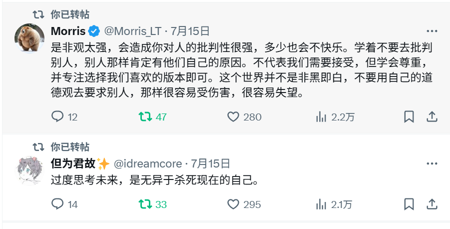
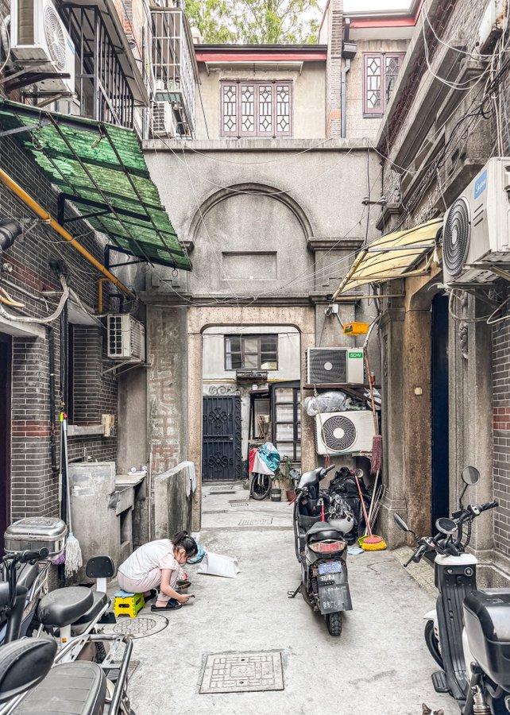
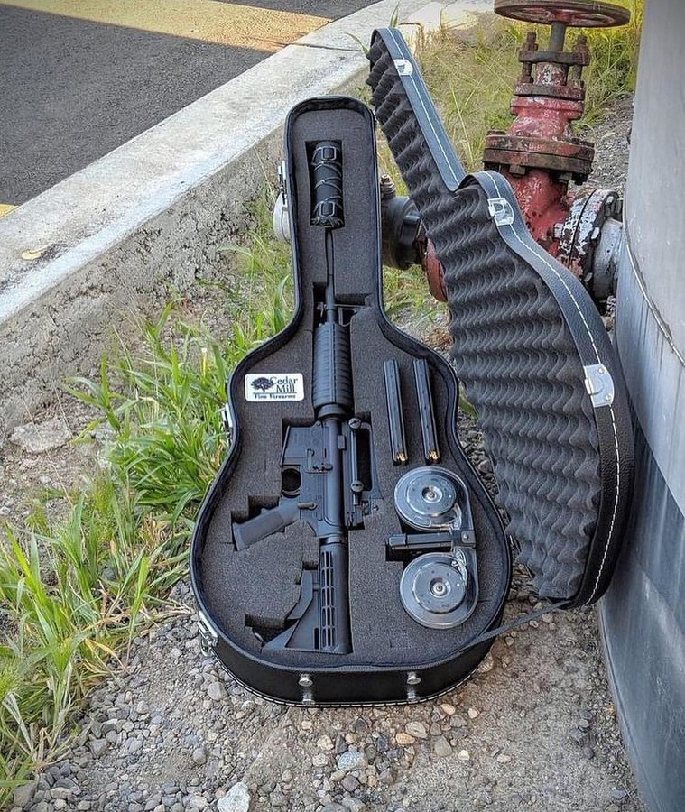
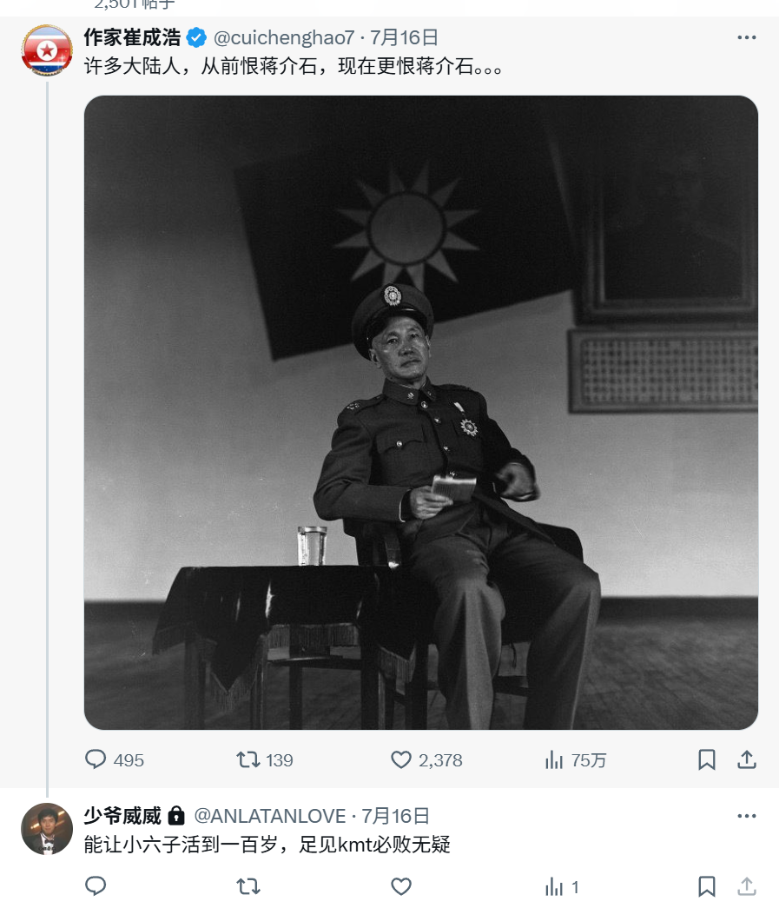

哎逆天，我都要香消玉殒了，还得熬，熬到那个人出现，但是并非一劳永逸了，还得熬，反正不断的证明自己，不过也好，别人上学找不到工作，我最起码有个长期雇主，虽然老子这个实习期又长又辛苦还得当舔狗

哎我活着像什么呢，我知道会有转机，但是这种等候，半死不活的感觉实在是，因为我真过过那种绝望的再也起不来的日子，如果不是命运有所转机，我今天还能在这说话吗，我怕的是再也不能用意志扭转的局面，我能牺牲的很多，我能爬到现在这个位置，只是因为我不把自己当人看，我一闻到一点机会的味道就开始疯狂生长，我有点不明白自己的底线在哪，好像所有的事情都是值不值，没有我喜不喜欢，只要能增加我生存的筹码就好了，只要别人进入我的生活，捞我一下我肯定会给他想要的，只要我觉得值得，难道我是阿拉丁神灯？？？我觉得我自己很低贱啊，以后我就没办法像以前一样任性了，我性格就这样啊，我真是没办法，我觉得只要我在物质上需要依赖别人，我就觉得我像鸡，尤其是对方对我是真的怜爱的心情，我就觉得很羞耻，我接受不了，其实我觉得这就是上天要我开始平等对待别人，我在精神上总是要压人一头的，我没那么强势吧，但是我就是希望被特别尊重，而且是欣赏不要那种怜爱，我觉得感觉完全不一样，怜爱的话谁不能，

老子这也太羞耻了，让人当个小宠物时不时过来摸摸头投喂几口，我尼玛受得了吗，经济独立和精神独立只能选一个

卧槽我发现我性格为什么拧巴了，我以前和别人在一起，我管你什么身份，身份越高我的费用越高，我才不会舔着你，而且我喜欢少不更事的男人，我教他做事情很爽，让他承认更年幼的小舒更强，其实我就是有点大男子主义，现在没钱了，我不得把人家伺候舒服了，我就是言语上稍微收敛点我都感觉是在被强奸一样

对吧，我花人家钱，我肯定得对人好点，这不就是花钱买我的特殊服务吗，和做鸡有什么区别，我觉得一旦要把人家当上级一样对待我就不爽，毕竟以前我赚钱是作为上位者的，就是那些人上人，他也得给我放客气点，我管你这的那的，现在可以了，人家叫我干啥我就得干，还时不时考验我下，我都这样了还折磨我

我觉得要精神和物质都依赖别人实在是太可悲了，这种日子，对吧平时别人赶着给我送钱，我觉得靠营销实在是太无聊了，选择了硬核的技术赛道，发现没背景玩不下去，我的名人效应被我干没了，从零开始的异世界，我现在有点老实了，我一直在给自己做心理辅导，但越想越绷不住，我还是那句话：有钱了不起啊！

一座建於 1926 年的百年老公寓。
「主席的頭髮」的淡淡殘留
你可以看到它

我对我同学就这样

"不管你信不信，无论男女，如果你在人群中一眼就能被人注意到，你是一个有点特别的人，那你必须要成为狠角色，成为强者。否则，弱者会对你嫉妒，强者会对你失望。你的人生远比普通人坎坷，你吃的亏，会比其他人更多。"
义不敛财，慈不掌兵，我今天早上还想这事儿呢，我有点心累