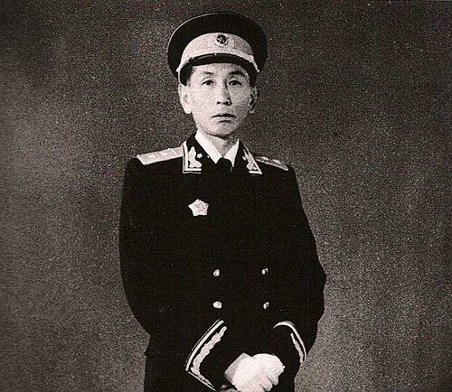

你知道为什么官方要推出丁真不，我才发现是大棋,理塘这地方历来都是藏区最反汉人政权的地方,但是汉人移民这个不好使,就是上面也怕下面乱,没钱了怕理塘变成藏独大本营,现在谁他妈来，派军队的话舆论压不住，把丁真捧出来，不就有汉人自己去吗，去做旅游开发，而且理塘人也可以分一杯羹，有钱也没那么闹腾，还有丁真有个很重要的解构意义，丁真的标准的藏名汉译是丹增，他和那个流亡政府首领丹增嘉措同名，藏民现在一想起丹增就想到丁真珍珠，不会想到在印度的那个达赖喇嘛丹增嘉措

我在想十世班禅到底咋回事，我觉得在文革批斗里他应该他38年生58年才20，他不懂政治，当然就和阿沛阿旺晋美在一起混，68年当众发表藏独演讲，又有七万言案，我觉得在文革的日子里，他很可能内心信仰破裂了，父母不保，雪域佛国菩萨死，身边人一个个倒下，他当时也就三十岁，按照他们那一套，此人社会化程度很低，经不起这种打击也正常，他79年居然结婚了，还是个十九岁的女孩，比他小20，他是主动要求想结婚的，天哪，他打破了班禅不能结婚的习俗，我觉得十一世班禅是丹增嘉措选的更合适，，，毕竟他这个信仰。。。还好有强巴赤列联系达赖，不然他这个十一世达赖，，，班禅他的信仰彻底崩塌了，他已经不相信自己是“莲花生大师转世”，不再相信“佛国重建”，他只是选择了做一个“在俗的政治人”。我也想知道达赖说的十一世在哪，不知道中共是当筹码隐姓埋名养着，还是，，杀了

阿沛阿旺晋美原来是霍康的私生子

这个死人照片拍的我喜欢，…………所以他做啥我都原谅了。我真不明白为什么我喜欢这种长相，我都不敢往外面说，像一个恋丑癖。我还就喜欢朴卡卡老了那味儿，他年轻穿日本军服像屌丝，本来就是个下级军官，当南韩总统才帅呢。阿沛是一个学财务的，那他滑跪我就觉得正常。我现在就喜欢阿沛了，我也要当老藏民，但是我他妈找不到他的资料。按照我看过的文献，加上我这会儿开始幻想了，我就觉得吧，他是个很可怜的被俘虏的贵公子，但是他技术出身所以滑跪了。他是一线的军官，所以知道闹钟很厉害，所以软抗争。代表大会他从来不穿中山装啥的，当时批斗藏民活佛他拒绝参加，他的子女没有参政的。这些信息给我幻想麻了，那种心死的感觉。我觉得他和朴正熙很像，面相方面。仔细想想，朴正熙标准朝鲜民族主义者，但是前半辈子当日本军人；阿沛前半辈子标准贵族公子，后来当了中共的官員。他这个人脸上和朴正熙一样，阴森的很，和达赖、班禅脸上完全不一样。唉，我操，我就喜欢这老阴逼的感觉！他这个人还是挺牛逼的，因为官方和流亡流亡政府那边都评价可以。官方评价你懂的，流亡那边的意思是这个人妥协的政治智慧保全了火苗。我感觉这个人他没有那么舔，就按照当时那个情况，不管你是啥民族都舔的一逼呀，这逼人他不舔，你懂不？真的给我看的有点那个什么了，给我想的快晕过去了。我躺在床上，一想到开人大那么多人，就他一个穿藏袍，其他少民都老实了，他还不摘耳环、留长发、扎辫子，这个有点太二次元了。一想到东东质问他为什么不穿，他说他代表藏民，当然要穿藏袍，这个不卑不亢。当时社会来说，藏袍是四旧，长发是旧社会象征，男女都不能留。他这个我真是想着晕过去了，这才是真正的亚文化，你懂不懂？懂不懂那种？他算是全国唯一一个合法穿藏袍的，这个才是真正的亚比！我草啊我操！他有一个老婆，十二个孩子，他老婆也是666！我感觉我被折服了。我昨天看昌都战役我还在骂，我说咋这么快滑跪，现在我原谅了，妥协的政治智慧罢了。给我想的浮想联翩。正常人是不会觉得这种长相很帅的，我就喜欢这种长中庭、薄嘴唇、锋利的眉毛以及高颧骨、皮包骨。我见过那么多老藏民，我发现我就喜欢阿沛。其实我以前就喜欢，但是我现在放弃了，放弃挣扎了，我就承认了。这种长相呢，我们称之为老寡妇面相，男人这样就和那种老阴逼寡妇一样，其实没有那种很雄性的感觉，反倒有一点老嫂子的味。我是说为人处事，而且给我感觉性欲很旺盛的感觉。我现在感觉就像一个那种恐同即深柜的男同性恋，因为我跟别人说，别人很震惊。然后我就跟他说，我说是这算是政治家裡长得比较好看的，顺便表示我喜欢黎明。我現在这个行为就好像一个男同性恋说：“卧槽，我只是说欣赏这个哥们这个肌肉，我特别喜欢娘们尤其是那个刘亦菲。”就是他们可能看不出来吧，朴正熙和阿沛脸上那股子阴暗和杀气不是普通人会有的。他居然给我说：“这不就村口大爷？”我心都死了。我跟他说，我发现我喜欢的长相有点抽象，然后他鼓励我说出来，结果他真的觉得抽象。我现在吧，我对谭咏麟这种我没啥太多的想法，因为我感觉这个人他就不是那种可以成事儿的，你懂吧？而且我发现政治家他不可能说长得特别英俊。如果你这个人长得真的特别英俊之类的，或者特别有特点，你就成不了事儿，因为你总被人在这方面被关注着。还有一句话不是说“大奸似忠”嘛，就说那些最坏的坏种长得一般都慈眉善目的。我不知道是我自己加戏，还是人家那气质确实有感觉。

其实中共很厉害的，他能想到拿丁真来解构达赖喇嘛的藏民精神符号，丁真珍珠的标准汉语是丹增旺姆，原本藏民想起来丹增是流亡噶厦政府的达赖喇嘛丹增嘉措，现在只有明星丁真，理塘素来是康巴的中心，是近代反华流血抗争的大本营，拉萨早被解构完了，甘孜靠丁真解构了，舆论战这方面中共实在是厉害的，，

。。。我已經對我的命運越來越接受了，啊我命中註定要和精神病攪😮‍💨那我談對象之後我就在電腦里搞個虛擬機，把我的賬號塞進去，我真怕被監控，還好對面是个文科生，，，
