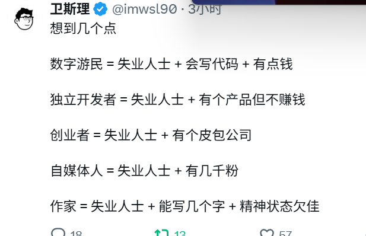

我觉得好空虚啊，我好空虚啊，为什么我连空虚都感觉不到了，为什么啊，有时候我觉得我真是一个很古怪的人，我总是冲动的做一些古怪的事情

哎我一想到会有人只用分期投资几万块就可以把我的一生买下来，我就有点难受，真是来得早不如来得巧，原始股东实力不容小觑。其实我一点都不亏，只是缺少一点“自由意志”的味道，我不希望我是被推到谁面前不得不接受，而是我能主动的去选择，但是这本就是个悖论，如果没有垂直的需求，我不会选择任何人，何况我本就不相信自由意志，我觉得太扯淡了。人家一个生活过得不错的青年中产阶级，为什么要帮我，说实话大家心里都很清楚，不是图财就是图色，很明显要色我不给，要财我也没，就是个无心插柳柳成荫吧！太吊诡了。

把朋友圈打开看了一眼我光速退出了，有没有那种可以满嘴讲学科的朋友圈，我真是现实生活没有任何可以拿出手，能混的圈子也是0个，没啥主动的想混的反正就是消磨下时光

