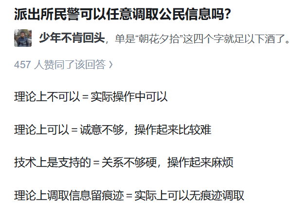
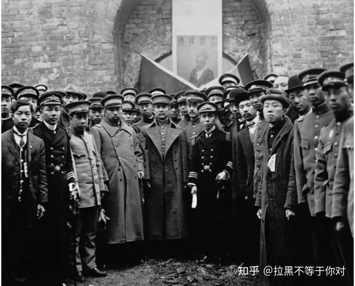
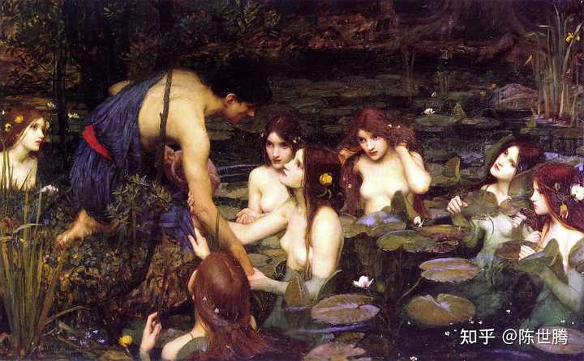
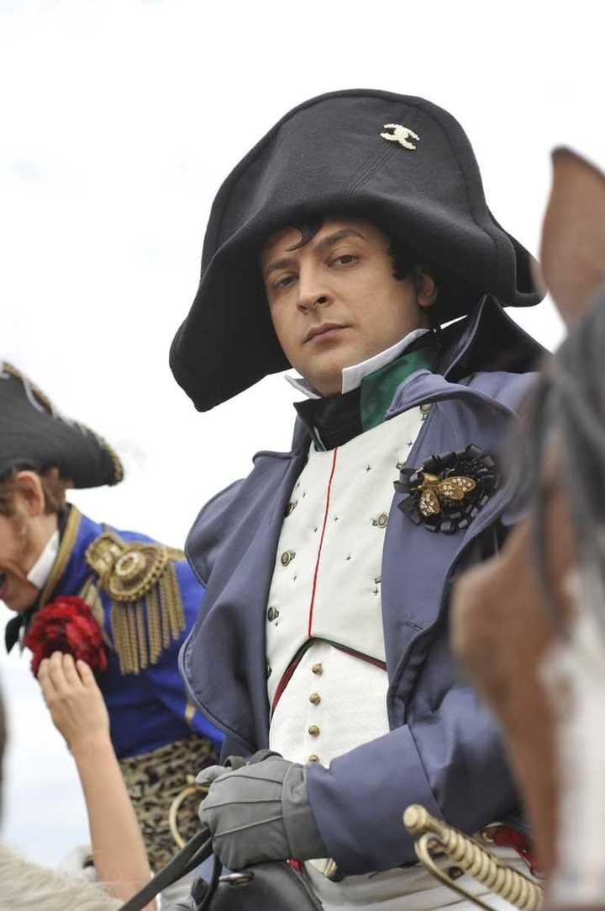

我想说个中国道教的冷门派别,摩尼教,虽然和道教关系不大,原型是琐罗亚斯德教，但是政治上的管辖是道协管，有意思，这玩意分布在福建，白莲教也是摩尼教分支啊，那没事了，我微信列表还有北京的白莲教呢，福建摩尼教其造像也被学者认为是“道貌佛身”，王重阳转世了

中国社会这一块

我一下子把自己干笑了，我感觉自己那叫一个骄傲那叫一个冰清玉洁那叫一个性格刚烈，呵呵，我意识到我明年将抱住一个公子哥情不自已大哭卖惨，我就感到莫大的羞愤，但是历史总是惊人的相似，上次这么干还是对芹哥哥，好吧我觉得很羞耻，说实话我眼泪不咋流，至少我不爱和别人说，芹哥哥那个就是看见我呜哇呜哇被折腾坏了帮我了一下呼啦啦把我迷死了，没别的长得帅又心意相通，又吊桥效应，呜哇呜哇一想到一站到幕前就有小婊砸来诽谤我，然后还有那种老男人，我现在急需榜一大哥招商加盟，啊雅蠛蝶哑谜爹，反正芹菜那套我是不吃了，说实话我觉得这世界也没有人能和他打出一样的操作了，因为我们都有精神病那个惺惺相惜，实在是一言难尽，我一想到我们都是精神病我心理那个舒服

我在想呢，得用怎么样的手段才能让我屈从，我可以接受工作上的帮助，但是我绝对拒绝私生活的帮助，健康了之类的，我就那么倔强，但是仔细想了想我的生命中总有人能让我屈从，我能听人家的大多带着一点威胁，我并不是傻瓜，但是回忆一下，这些人是脑残吗，为什么要这样对我，提前感受青春期叛逆青少年？

生命就是不断的妥协，妥协的政治智慧很重要吧，别人觉得我和大家不是一个图层的，像世外飞仙一样神游天外，实际上我也希望这样，但是现实实在是太严峻，我一个人哪能对抗的了结构性风险，，，我需要一个现实中能上桌吃饭的结构接纳我，我尼玛一直在努力的学习，怎么说呢我其实发现，学历压根不是敲门砖，真正的敲门砖是过硬技术和长相，其实千载不变的热门大类专业就俩，情商和颜值，其他0分，其他专业总是有一个周期性的涨退潮，说实话情商很高的智商也低不了，学东西也会很快，我觉得情商高的我没咋见过，至少我的同龄人基本上被我降维打击，像那些一官半职的老头也挺厉害，但是他们不和我争资源啊

咋说呢，我最近的焦躁就来源于，我接下来必须要屈从别人的安排，而且这种安排之中是带着爱慕的，我本身不带资源进组，尼玛给我安排好事儿那个赏识里一点爱欲没有很难说，然后我一直挺讨厌别人喜欢我就给我好处，我想凭自己能力，但是现实太严峻，我接受了，我最近一直在做心理建设，我不想那么快就投降

我为什么就是接受不了别人对我有这种偏爱呢，就是彼此身份差太多了，我觉得我看不穿对面的感到焦躁，其实这对我来说是一种很直勾勾的凝视，要审视我到底过不过关，因为我需要对面给的资源所以我不能说撂挑子直接开骂，我必须表现出他希望的样子，说实话我也没有装，那本就是我的一部分，我找到原因了，是凝视，我觉得被这样偏爱是一种凝视，当身份阶层不一样的时候，上位者的关怀就是凝视，我这种有虚幻自尊的人脱不下长衫，我一直在做心理工作，一定要好好的争取机会，一边心理想有钱了不起家里有背景了不起？矛盾的很，现实层面我真需要这些资源，精神层面我讨厌所有特权者，仅此而已，还好我早就习惯凝视了。我一直在反思，为什么氢哥哥我就那么无所谓，好像是因为我的自然的生理压到了社会的心理，他帅啊他怎么样对我我都舔着他，舔他本就是我内心第一性的感受，被凝视不被凝视的无所谓，这个操作还是吃建模，我是真怕我之后搅成复兴东北老工业了。然后我心理很注重秩序伦理之类的。我的焦躁就是，我本身自认为或者渴望成为一个永不可能被人乘虚而入的存在，结果我一次次被渗透成筛子了，我很高傲很刚烈的一个人，我不想被凝视，但是我又渴望被一个我认可的人认真审视，这种矛盾心理我觉得没有多少人能明白。所以我总是浮现出一股难以言喻的冷笑或者抿着嘴。羡慕二代，还是这句话。

其实我觉得爱情本身就是社会话语体系下的产物，张力就来源于权力的错位和游移不定，所以我本身没啥爱情不爱情的，我拒绝自己被凝视，但是每个人都有自己的命运吧，不管怎么样，我觉得这个挑战我接下来了，其实结婚是我被现行体系接受的一种表现吧。其实一想到以后要被查手机我心理有点难受，我感觉给自己请回来一个领导大爹，其实本来就是自己的上级，一想到这个我尸体有点疼，就是我感觉有一种抓肝挠腮的感觉，难受的要死了

我一个底层左翼自由主义知识分子NGO从业者数字游民，找一个右翼保守主义建制派食利阶级，搞笑不，我这下真是保尔柯察金和冬妮娅了，有点难蚌

我最近好像進入到新的生理周期了，吃得少但是不餓，可能是因爲身體進一步優化了吧，我查資料説是我要變得更好了，就是身形

咋説呢，孫文感覺就是長得帥，説實話，乍一下站這群人裏，氣質長相一下子，難怪是門面人物，黃興吃了長得不好的虧

“打110接线的是当地公安局，带区号才能打到派出所。两者区别就是你打110公安局会把你的情况交接到属地派出所，派出所是要每天给公安局做警情回复的，相比之下打110会更把你的事当个事办”每日一點點社會經驗

约翰·威廉·沃特豪斯的名画，许拉斯和水泽仙女

小澤這個拿破侖COS的不錯

我好想死呀，我想看马尔克斯的书，但是我又没有勇气看，因为又长人物又多，关系又复杂，我想看霍乱时期的爱情，但是，但是我怕我又看不懂，我这个工作记忆太短，我记不住那么多人物，而且我觉得有这个闲工夫，我可以把百年孤独看了，我还想看源氏物语，但是我感觉我又看不下去，反正是

我在想呢，得用怎么样的手段才能让我屈从，我可以接受工作上的帮助，但是我绝对拒绝私生活的帮助，健康了之类的，我就那么倔强，但是仔细想了想我的生命中总有人能让我屈从，我能听人家的大多带着一点威胁，我并不是傻瓜，但是回忆一下，这些人是脑残吗，为什么要这样对我，提前感受青春期叛逆青少年？生命就是不断的妥协，妥协的政治智慧很重要吧，别人觉得我和大家不是一个图层的，像世外飞仙一样神游天外，实际上我也希望这样，但是现实实在是太严峻，我一个人哪能对抗的了结构性风险，，，我需要一个现实中能上桌吃饭的结构接纳我，我尼玛一直在努力的学习，怎么说呢我其实发现，学历压根不是敲门砖，真正的敲门砖是过硬技术和长相，其实千载不变的热门大类专业就俩，情商和颜值，其他0分，其他专业总是有一个周期性的涨退潮，说实话情商很高的智商也低不了，学东西也会很快，我觉得情商高的我没咋见过，至少我的同龄人基本上被我降维打击，像那些一官半职的老头也挺厉害，但是他们不和我争资源啊，咋说呢，我最近的焦躁就来源于，我接下来必须要屈从别人的安排，而且这种安排之中是带着爱慕的，我本身不带资源进组，尼玛给我安排好事儿那个赏识里一点爱欲没有很难说，然后我一直挺讨厌别人喜欢我就给我好处，我想凭自己能力，但是现实太严峻，我接受了，我最近一直在做心理建设，我不想那么快就投降，我为什么就是接受不了别人对我有这种偏爱呢，就是彼此身份差太多了，我觉得我看不穿对面的感到焦躁，其实这对我来说是一种很直勾勾的凝视，要审视我到底过不过关，因为我需要对面给的资源所以我不能说撂挑子直接开骂，我必须表现出他希望的样子，说实话我也没有装，那本就是我的一种身份，我找到原因了，是凝视，我觉得被这样偏爱是一种凝视，当身份阶层不一样的时候，上位者的关怀就是凝视，我这种有虚幻自尊的人脱不下长衫，我一直在做心理工作，一定要好好的争取机会，一边心理想有钱了不起家里有背景了不起？矛盾的很，现实层面我真需要这些资源，精神层面我讨厌所有特权者，仅此而已，还好我早就习惯凝视了。我一直在反思，为什么氢哥哥我就那么无所谓，好像是因为我的自然的生理压到了社会的心理，他帅啊他怎么样对我我都舔着他，舔他本就是我内心第一性的感受，被凝视不被凝视的无所谓，这个操作还是吃建模，我是真怕我之后搅成复兴东北老工业了。然后我心理很注重秩序伦理之类的。，我的焦躁就是，我本身自认为或者渴望成为一个永不可能被人乘虚而入的存在，结果我一次次被渗透成筛子了，我很高傲很刚烈的一个人，我不想被凝视，但是我又渴望被一个我认可的人认真审视，这种矛盾心理我觉得没有多少人能明白。所以我总是浮现出一股难以言喻的冷笑或者抿着嘴。羡慕二代，还是这句话。我心理的矛盾压力太大了，如果对方只是情欲的或者其他目的的凝视我，我会觉得利用就利用，反正你也没把我真的当回事，但是如果说带着怜爱和欣赏，我可能把持不住，我最怕我自己缴械投降啊，我的坚强只适合在公众面前，私下里逗我几下我要是真哭了咋办，我的自尊心可能会让我第二天上吊自杀，然后我还不会上吊自杀，就是矛盾重重，其实我觉得那些小说都写的很不好，网文里面那种跨阶级的爱情小说，写的挺烂的，杜拉斯的情人写的好，亲身经历就这样，我一想到我开口说一样的话我是有点没绷住，尴尬和羞耻，前额叶扣带还是太强了，我需要解决这个心理问题，巨大的心理压力，哎，其实我压根不是那种爱流泪的类型，关系没有那么亲近我的眼泪只是为了换资源，可是我想不明白能好好说给我的，为什么非要我服软，哎呀我真是谈恋爱呢还是找领导呢，非要看着我受刺激自己处理完才站出来说你这个人可以以后我罩着你你别担心，投offer这一块

还能去保持着自己原本的选择的话，那么这个人文的意义就体现了，虽然更多是权衡利弊的结果吧，那么也证实彼此的价值。反正我就看这玩意儿，感觉怅然若失了吧，我感觉我对于婚姻没有多少自由。但实际上我知道大家都没有自由，大家无非都是在寻找那一块应许之地，但是应许之地怎么可能出现在一个人身上？我们都只不过是在这个过程中不断地去逼近这个过程。我们自欺欺人，我们制造幻觉，我们在消费。

看源氏物语，感觉男主角和我很像，每一个女主角也和我有共同之处 ，有一堆幸福以及伴生的痛苦吧，真的，感情上比较深刻的人 压根不可能是白纸一张，要深刻还得有深刻的对象，能有这么多不同体验的怎么可能是白纸，哎看得我尸体疼疼的，只可惜我不是皇子，如果我也是皇子，我的很多痛苦就不是痛苦，我的行为就说得通了，就我很多行为在一般人看来就是纯犯病，就比如把少爷踹走了，或者说不愿意和青菜在一起，他俩都挺好的吧，反正我就是有我自己的原因，前者我不喜欢我不愿意欺骗对方，后者我喜欢但是我必须牺牲我自己，那算了吧！

我一个底层左翼自由主义知识分子NGO从业者数字游民，找一个右翼保守主义建制派食利阶级，搞笑不，我这下真是保尔柯察金和冬妮娅了，有点难蚌

其实我觉得爱情本身就是社会话语体系下的产物，张力就来源于权力的错位和游移不定，所以我本身没啥爱情不爱情的，我拒绝自己被凝视，但是每个人都有自己的命运吧，不管怎么样，我觉得这个挑战我接下来了，其实结婚是我被现行体系接受的一种表现吧。其实一想到以后要被查手机我心理有点难受，我感觉给自己请回来一个领导大爹，其实本来就是自己的上级，一想到这个我尸体有点疼，就是我感觉有一种抓肝挠腮的感觉，难受的要死了

我的归宿大概率是建制派很老派的男子，基本上就是一个权力或者是怎么样的一个东西的承载的符号吧。其实我也知道，我不喜欢这样的，索然无味，就是说这种情绪的共鸣可能比较少。唯一真正能维系彼此的，只有那种只有对方知道的，抓心挠腮的寂寞的感觉吧，所以这是最适合的，并不是最喜欢的。没有人可以保证自己完全的忠诚，在情感关系里，既然有生理上吸引的这一方面，那么这就是个不可控因素吧，并不是像君臣一样，因为这个人格上纯粹的东西而紧紧地维系在一起。但实际上这恰恰又是一种很忠诚的感觉吧，因为这个激素之类的一顿轰炸之后。