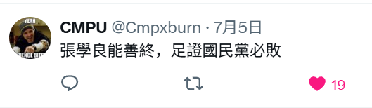

我曾感觉到秘书与团委是中高级官员的上升捷径。秘书与团委出身有个很大问题，实际工作经验不足，比较虚。秘书对上司的唯唯诺诺，容易产生一种唯上轻下的人格。

一个干部，无论是市委书记还是其他职位，其核心竞争力在于能创造价值。这个价值不是空泛的，而是解决问题、推动发展。
解决复杂问题能力： 随着职位层级的提升，需要解决的问题也越发复杂和宏观。
资源整合与调动能力： 领导干部的一项核心能力就是整合和调动各种资源（人力、物力、财力、政策等）来实现目标
风险识别与应对能力： 任何发展都伴随着风险。需要对潜在的经济、社会、环境风险有敏锐的洞察力，并具备有效应对危机的能力，确保地方平稳运行。

不怕二代纸醉金迷，就怕他想证明自己。

彭立发走了，刚刚得到消息，判九年，令人感叹，全国诛杀同党呢，万万没想到把我也牵连进去了 ，一想到我也深深的参与了白纸运动，我就为自己骄傲，不过那时候我就像大部分学运的学生一样，有点烧昏脑了，还好没有太倒霉，总感觉那个审讯我的国安老条子对我有同情，他说有些事情要知道，但是不要评价。

西爾維奧·阿拉松（義大利，1845-1912 年）《吻》（1892 年）

这话真扎心，但是我也觉得

老子刚刚吓出一身冷汗，我他妈发现我的人生轨迹居然和体制内关系那么大，我知道和这些人我会有关系但是没想到那么大关系，我寻思我做NGO的和民政方面有点关系算球，我真的有点害怕了，我真的有这个贵气吗，一个人的气运和位置不匹配必然是有灾祸的啊，

我想起来桃子是个副处级别的官我真是对中国社会释怀了，二十八副处级，实力不高全靠父母，我看他那个脑子做官也到头了，我不知道反正没直接接触过比他大的官，反正因为他我对体制内的没那么仇恨了，主要是看到条子就想起他，对我略显羞涩的结巴样子，哎，要是我俩有一层关系我还要担心那么多？卧槽呀谁知道我那个惊恐，我是事后很久想起来查了他的警衔，反正我想起来他的模样感觉十分可爱，但是他的身份我真的很害怕，我觉得我和他短暂的相处他处处的怪异压根不像普通人，可我被甜蜜蜜包裹住压根没有思考过这么多，我还叫他辞职和我去创业吧，想起来我就想笑，我就是一辈子努力也没他出身起点高，我俩这段露水情缘，我想给彼此内心都留下了不可磨灭的印象吧，我觉得他有点可怜了，怎么一辈子活在父母的阴影里，我有点搞不明白为什么他对我才是诚惶诚恐，他应该是没想明白为什么我对他那么好吧，完全搞不明白我的动机，反正我就觉得爱情就那么奇妙，我一见钟情一个比我大十岁的人，就那么如梦似幻，等我事后很久，我才知道他是什么人，这个也太罗曼蒂克了，一场真正的主体先于身份的情缘，想起来他羞涩的模样，我都不知道他怎么带他手下的人，想起来就好笑，我感觉我在这个方面有点魔怔的出奇了，我告诉他我不考虑和他在一起，玩一玩好了，因为我在政治方面和他绝对是合不来的，于私他是我的情人，但是离开我们情人那层关系，他是助纣为虐的爪牙，也是一个彰显着平庸之恶的特权阶级，就是他这样的家伙破坏社会生态，我的心理有一种极大的矛盾，这段关系本来就是没结果的，我不想投入太多,,,其实桃子也比较可怜吧，我还和他说我喜欢他是因为他像我芹哥哥，，，我发现我以前嘴里是一点禁忌没，，，

到网上人说二代们是咋样咋样的，我心理感觉有点古古怪怪，怎么说呢，其实我算是沾光了吧，我小的时候有个二代朋友，比我大很多，他和我讲古典文学，然后我就捣鼓起古典文学了，和他了不少东西，后来岁数大了因为足够文艺逼很受欢迎，认识了少爷，少爷给我添了一把火，他也是我的老师，虽然是失败的情人，但是成功的老师，因为他我学命理，这才认识青菜，其实他们说的那种趾高气昂的，我也遇见过，但是被我喷到体无完肤😃跑路的跑路了，不跑的就是在求我的认同感，我觉得很奇怪 你和我求啥认同感呢，对我好又见不得我脆弱 这些人死球坏，天天说我多有魅力多有天才，没一个人接受我就是脆弱敏感的，前天倾诉了一下被刺激坏了，他一开始对我很不屑，觉得我不可能真的读过那么多书，认为我只是装逼佬，但是万万没想到我是玩真的，其实他说他对我没有情欲，可是我心里和明镜一样，对我寻求认同感，尤其是男性方面的认同感，搞得我很尬尴，，，明明亲口告诉我，我痛苦的时候可以和他说，但是我觉得诚意实在是不足，算了吧你没有资格，我的心情也挺复杂的，其实这人对我还不错，可是我觉得太没诚意，我对他有一丝同情，读书想当文艺逼但是脑子里其实空空，我在努力帮助他，但是这种富二代是扶不起来的，他肚子里那二两墨水还没让自己认清自己定位，注定成不了事情，哎！我有时候脾气也太大了，随意的喷人，啧，有点可怜啊，那点自尊心，自以为自己多热爱学术啥的，其实就是家里有钱经得起折腾而已，当我不想啊，我又不是那种不需要考虑生存的人，反正也有点感叹天命无常吧，作为非科班出身的在实操中远超那些科班出身的，我也觉得挺开心的，我需要一些认同感，需要来自那些比我更强大的人，可是和我亲密接触的人，没有这种，有些人仅仅只是比我更有资源而已

不管你的人被谁占据～都请你原谅我～始终带不到墨尔本的翡翠

可悲啊，可悲啊
我见世间应自在

这时候我就感觉超脱红尘了一样，其实我一直想保持这观人如白骨的状态，可是我情欲太重，我是遗忘了自己是修士了吗，其实我一直没有啊，有点那种酒肉穿肠过，佛祖心中留的感觉，我不该想太多其实，天门玄牝，阴阳二合

哎我喜欢吴国敬的声音喜欢他作曲，但是他不咋唱歌我真的死了

我感觉人的生命真的很奇妙，我的生命被无数个偶然塑造成今天这样。谁知道我内里本色是自卑脆弱敏感内耗的，我日常却又表现的强大又跋扈，和我生命里一个接一个的偶然是有很大关系的，有时候真的感觉到一股子身不由己的滋味，一旦我偏离我生命的主车道一下子就被击飞回到自己的位置，也会略感身不由己，我想起来我强大的自信心，和我相当一段日子混在人上人身边有关，那些自己白手起家的技术新贵欣赏我，我很开心，那些家里有钱有权的二代也会欣赏，但是这些人很不识相渴求我的认同感，还想给我指点江山，被我喷的体无完肤，我感觉我生命真的挺需要人上人的，看见他们我才能感觉到自信😮‍💨

我发现我的自信压根不来源于我自己，其实是来源于攻击性，我需要被偏爱着，而且我并不满足一般的偏爱，可以说是我的青春期被身边人惯坏了，再就是攻击那些执绔子弟，这个快感是很强烈的，看到他们的自尊心被我击碎，哇这个是真的很爽的，那种撕裂别人幻想的感觉，我总感觉我是一个私下很讨厌的人，我的傲慢我的无礼，因为我其他的可爱之处只会略显风骚，并不会惹人恨，这一点的确不错

哎最近攻击性有点太强，不知道对谁释放，我同学有福了，我这个人虽然压抑又低调，但是你要真的搞我心态那就

为什么感觉有钱人不爱玩手机，我尼玛有钱没钱我都爱玩手机，但是感觉物质精神充足的对奶头乐需要更浅

我嘎巴死了算了好不，我真的有点接受不了年龄差十岁这种，我做做心理工作算了

就是真的搞不明白自己想要什么，或者是说我到底能为我想要的东西要出多少，我到底渴望的是什么，哪个对我来说更重要，我也不太明白，只能等在宦海沉浮中让历史解开这个谜团

其实我感觉考察我考察六年算短的，我前前后后考察了九年而已，十年熬出头算不错的，可是离目标越近我好像也有点“脑袋跟着屁股走”了？搞不清自己想要什么了

其实感觉和少爷分开是对的，此人定力太差，决断力不行，亦没见过多少世面，跳不出舒适圈，在他那个圈子混着，我就是做太太我也不会做的安心的，毕竟身边也都不是什么好鸟，高不成低不就的一群男宝在一起就一天天不务正业，他那些狐朋狗友也迟早会把我害死，朋友圈子还是很重要，还好我现在没啥圈子了

好吧，我再也不骂公子哥了，今天加了个群，我才明白国男啥鸟样，公子哥们最起码不计较钱不钱的，我也不是个爱计较钱不钱的人，国男总想找好女人，从来没想过很多东西是要等价交换的吗，又不是说有钱就行了，真把自己那几个臭钱当回事了，少爷就是这样的一个贱货，难怪我更喜欢和二代们混在一起！家庭出身一般靠自己翻盘的中产阶级，很多一股子暴发户味，我真受不了，我现在要把这一群全部拉黑了，看见那些傻逼我感觉我最近讨厌的那个都可爱多了😬

我不明白为什么有人感觉，一个本就平平无奇的人，在一顿鼓励之后就真的可以穷小子逆袭，穷小子是没可能逆袭的，能逆袭的绝对不会是真穷，有些人谈吐仪态和人情世故一看就知道这人能成，和兜里现金有多少真没啥关系，那些女的咋那么爱投注一波，有那个陪人家的心思不如提升自己，这世上有的是路

我意识到大部分人就是空虚自卑的，因此二代们会更好，因为资本雄厚经得起折腾，一般男的压根禁不起折腾，那就活该他们找傅首尔了

我之前不是说上面管不住下面了吗，就是我一直说这个，最近天水那个事情，闹这么大，新华社乱七八糟一顿批斗，就是硬没抓出一个该杀的，死鸭子嘴硬是厨师自己加的彩绘颜料，其实就是地方豪强和上面在对抗呢，我看这事儿27年不能搞定，地方真的会出问题，尤其西北一定会泛绿化加重,中原各种地方豪强也会露头,现在已经有当年九十年代那种治安问题露头了.如果不出意外接下来西北一定会绿化，待不得.中原那种黑社会也会露头,这俩地方压根没啥科技点,能源有但是没有科技和良港,台海如果这段时间，赖医生修宪,我看真要完了,因为真开打两广福建得很多地方撤到内地,东南是为数不多发展经济的地方,又一片没了那就完球了，到现在是五代目了，当前习近平是集权最大的，如果他解决不了这个问题，那么后患无穷，他最多就是到27年 ，那之后就得下台了，这么一看苏州杭州南京的确是未来最好的地段

相比北方的行政腐败+族群割裂，西部的宗教势力蔓延，南方的不确定战火风险，江南这一块确实可能成为最后的避难所与财富中心。

我怀疑上面乱掉了，我很悲观，因为甘肃都压不住那就出问题了，上面这下必须放权给商人，因为没有江南的支持就等着白帽帽杀过来吧，毕竟只有商人才希望秩序稳定，商人要钱那些人要权啊，我昨天不是说美国稳定币法案必然倒逼中国吗，现在东亚虚拟金融中心没有了，因为前些日子的新加坡法案，日本老龄化严重国内矛盾很大，无力支持新型经济，东南亚政府公信力不足，黑产太多，HK和大陆没区别，现在马斯克也放话贬低法币支持稳定币，欧美商界云集而响应，中国现在玩那套基建狂魔的弊端暴雷了，可是当年那些官员早死了，问责谁去，经济的大梁就落在外贸上面，外贸换个外汇累逑死了，用的都是USTD，现在不快点想办法把稳定币怎么样合法登录大陆的问题解决了，但是我们政治是老人政治和军人政治倾向不断加强的，这些老东西不放权他们嘎巴死了就死了，我们咋办，要改革必须放权，而且要给技术新贵，我这一点也预测对了，地主老财那套玩不转了，但是稳定币改革到中国，就会倒逼中国的政治改革，，一系列的蝴蝶效应有点不敢想象，现在甘肃压不住，高级干部库库抓，上面乱糟糟的感觉，如果不能抓紧时间改革，恐怕就没机会了