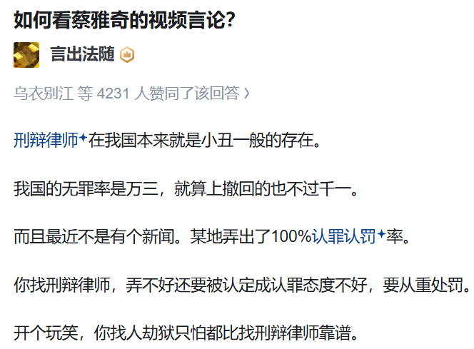
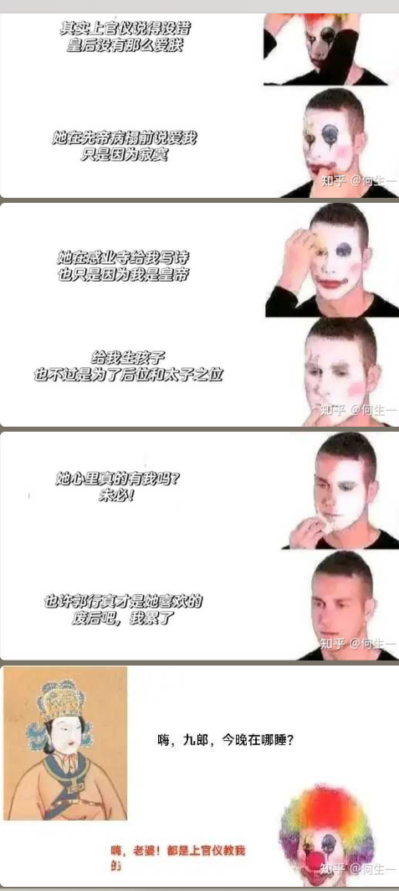
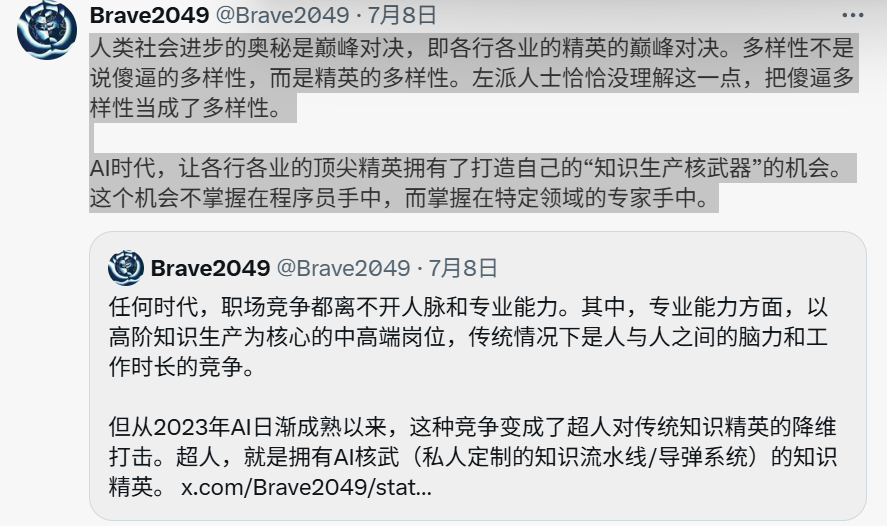

最后一句没绷住。

在我国要规避和降低法律风险，最有效的两点是。

一、钱少留境内，免得有人惦记。可以调动的资金转出去。企业股权结构设置复杂点，别大剌剌自己名字挂上面。非经营性的固定资产少买

二、规划好身份，外籍还是会一定程度被特殊对待的。家里有直系亲属在国内，Q签转长居，再转永居，家人都润了，法人签、置业签。办法多的是。永居现在都约等于身份证了。这玩意真不是网上说的那么金贵，就是要熬时间。网上很多东西都是胡说八道，实际上你那天想开了，想复籍都行。

就是你知道上个世纪90年代经济下行之后出现有多大的问题不，普通人知道最多的就是工人下岗，当时92年南方讲话之后市场化改革热潮，但是问题来了，当官的不会做生意，搞的这个经济出问题了，通货膨胀失控到了九十年上升到了百分之二十四，你知道24%意味着啥不，只能说咱们这个体量比较大，经得起折腾，要是说你换日本韩国早就玩完了，早给你挂路灯上吊死了，95年到02年国企改革各种中小型，国企倒闭将近2,700万，工人直接下岗冲击到家庭约1亿人，那时候还没有14亿人呢，就是现在来看这个数字还是很可怕的，那些工人铁饭碗一夜破灭，养老金医疗断供，很多人失业，然后去上访，还有去自焚抗议的，然后就要呼吁去监视这个政府，这个过程中，这个过程中，四五十岁的中年人医生的努力瞬间桂林四五十岁的中年人一生的努力瞬间归零，所以我强调你不要一天tmd看着那个死工资，你要去想办法提升自己的抗风险结构，这个还只是城市，农村里更严重，农村里重税收，出现了很多杀人的事情，就是因为这个征税的问题，应该最严重的就是那个江西了，把他们那边的管这块的人打死了，农民给打死挂城墙上了，还血洗警察局，2000年8月16日上午，大约有50人左右聚集在袁渡镇镇政府门口，要求与镇干部对话，造成数千群众围观、声援，接着群众砸开镇政府铁门，冲入院内砸碎办公室的玻璃，搬走各种办公用具，追打乡镇干部，一些村干部的家也遭到砸抢。这个乡长和另外一个干部让抓住，来冲击的农民有50多个，就是一人给他一拳，他也得成潮汕牛肉丸了，然后桃子们来了，桃子们也被锤了，就是说这个事情把各种机关给冲击到，然后还就是说不是单纯的杀人泄愤，是虐杀性质，集体的虐杀性质，这还只是死了几个人，不计受伤的，2000年江西开始试点取消农业税，06年全国全部取消，农业税在中国几千年终于取消了，然后这一时期第1代农民工进城，90年代地头蛇特别多，然后以前不是有保卫科吗，像各种高校机关，它都是有配枪的保卫人员的，现在只有u型锁了，那个时候青年就是躺平状态，教育出问题，大家认为这个教育出问题了，医生也出问题了，司法也出问题，干部也在贪污腐败，大家觉得这个社会完蛋了，公共道德秩序坍塌，人们各扫门前雪，这种极端的精神的空虚之下出现了一个很严重的问题，92年轮子开始传教，就是轮子能在咱们这儿搞得这么大是有原因的，如果一个国家不能解释死亡、苦难和意义，民间自然会构造出自己的神学，你不觉得这一切都很相似吗，所以我才觉得可怕呀。我说的桃子是条子的意思，就是我们现在跟90年代的对比一下，90年代工人大下岗，我们现在也在各种裁员缩减员工嘛，还有企业的体量，当时改革风风火火，但是搞得稀里糊涂，现在没有什么大的改革，但是今年5月过来看起来要重拳出击了，从董小姐事件就可以看见，董小姐本身不算是他们那个圈子里混的很牛逼的那种，但是网民挖来挖去，牵扯到的人越来越多，这一群人里就没有一个人能把这个舆论风波给堵住？按照以往的新闻惯例，这是不可能的，那么意味着这场事件本身就是由更高一层的天龙人在造势,想着把学阀给扫走，给底层人一点路走，然后最近的这个黄杨甜甜的事情,把雅安的贪污腐败给挖出来了,一方面给社会泄压，一方面又在扫一些地方的问题，因为财政紧缺的情况下，他们还这么大手大脚的，真是令人痛苦，但是这个改革真的能改好吗 船大难掉头，搞不好就翻车了，现在农业也有问题，一方面是自然灾害，一方面是一天到晚的放卫星，然后各种干部跟傻逼一样管来管去的，一天锄头都没拿过，瞎指挥，农业产量不会太好，像这个群众的冲击事件，这两年也不得少，现在社会治安也在慢慢的出问题，向各种报复社会还有一些黑产在不断的上升，地方的武装力量也在搞，一部分是以智力为主导的，一部分就是靠肉体的暴力去掌握话语权，加上最近江苏的那个学生跳楼了，还有山西大同案，教育医疗司法行政，大家都要怀疑一波，再一波去审视他，比起本经济玩完被动的去审视，不如上面的人主动放出一些信来泄压，当时92年轮子起家，就是因为当时的精神的文化真空，还有话语权的真空造成的，现在也是各种各样的什么玄学之类的特别兴盛，塔罗牌了，注意了，乱七八糟的，但是那些人的水准非常差，根本就不了解东方或者西方的文化和历史，怎么可能去给人做一个指导呢，所以我觉得接下来走向可能就跟90年代差不多

埃及神话在我三年前神话学初步时候了解过，其实后面我就打算看日本神话了，没看完我就干别的去了，我一直趴在中国和中东玩，还想看希罗多德，我那时候还没明白奥西里斯为什么没有找到他的阳具，我发现学习真的是量到一定就质的飞跃了，阳具的政治意义我是在后面学晚清性犯罪律法的时候才明白的，希腊剧本我也没看多少，感觉我真是好没文化，，，

石榴籽，少女不可逆转的命运。可悲的珀耳塞福涅的灶神之火为谁燃，这时候的她全然不知会吞下石榴籽成为冥王哈迪斯的妻子。

《新唐书·上官仪传》:初，武后得志，遂牵制帝，专威福，帝不能堪;又引道士行厌胜，中人王伏胜发之。帝因大怒，将废为庶人，召仪与议。仪曰:“皇后专恣，海内失望，宜废之以顺人心。”帝使草诏。左右奔告后，后自申诉，帝乃悔;又恐后怨恚，乃曰:“上官仪教我。”

所以别轻易搅和领导家里的事情，人家两口子打一炮矛盾都解决了，到时候就得你背锅，上官仪真惨

李治：小妈开门，我是我爸，小妈昨晚的事别告诉我爸，小妈我爸厉害还是我厉害

兄弟和女人哪个重要历来多有争论，最后女的兄弟杀死比赛。

我说话还是太燥了，虽然我是看人下菜，反正我意识到了，改不改两说，燥归燥，不燥树立不起权威，但是就怕眼瞎在不该燥的时候习惯性燥了

当一个人自己价值低的时候为了追求高价值就会追求奢侈品，或者习惯性贬低或否定他人,就是每个人做某种事情有他的动机，他做出了自己认为有益于自己的事情，当然他也得承担与之对应的代价

我顿时发现我学过的东西可真多，就连冷门的学科我都能插几嘴 ，我想保持高强度阅读的习惯，可是感觉最近很少有系统性的阅读书目

我感觉我适合黑人的妆容和造型,我感觉我更适合左三那个女的的造型

权力只对他的来源负责,这句话就太有意思了

历史书上的一行字，便是一代人的大半生

外事不决怪欧美，内事不决怪资本

戴高乐看到法国战败，哭着说：我们的国家（哭泣）会变成什么样子，会不会变色（被德国人），戴高乐说：我才不怕变色，我们法国有百万精壮性压抑青年让德国人有去无回！这就是战胜于床单

年尾年初是指避免11、12、1、2这四个月。除此之外还要避免6、7、8这个三个月太热和9月有大量的实习生进入。所以做手术优选3、4、5月和10月。当然，手术也是分级的，如果是一级和二级手术就不用这么挑时间了，随时可以去做。

其实有些话真的挺对的，要是真爱的话，有的是排除万难的法子，我今晚又有点发春了，我还是太低姿态了，因为我还稚嫩，觉得自己配不上那种人，其实我想杀了所有从中作梗的人，我到底不明白爱情和自我价值的实现哪个更重要一点。

哎我觉得有点尸体疼，其实我有点自卑，我是好像很聪明的样子，其实我从哪方面来看我都没什么闪光点，学历也好家庭出身也好，不光称不上闪光点甚至可以说污点，反正很多事情就是这样的，有点希望谁能排除万难的喜欢我，但是我都忘了我多久没有敢这样想了，人的贪欲无穷无尽，排除万难喜欢我吗 。。。这个排除万难还包括我那些雄心壮志，我想要做点实现自己价值的事情，我想要代偿我那被所有人当做微沙的日子，其实我搞不明白我到底是利欲熏心还是怎么样，我搞不明白自己想干嘛，适合我的类型我不敢去想他能把我放的太重要，其实我只是想证明自己不是一个可有可无的东西而已，我不在乎我是谁

“人类社会进步的奥秘是巅峰对决，即各行各业的精英的巅峰对决。多样性不是说傻逼的多样性，而是精英的多样性。左派人士恰恰没理解这一点，把傻逼多样性当成了多样性。

AI时代，让各行各业的顶尖精英拥有了打造自己的“知识生产核武器”的机会。这个机会不掌握在程序员手中，而掌握在特定领域的专家手中。”

我发现我爱情焦躁就在这里，我踏马把你当兄弟你和我说你要日我，我感觉友谊破裂我道心破碎，不想失去好朋友也不想艾草，而且我对对面好感大打折扣，好俗，，，我感觉一下子豁然开朗了，芹菜和MR.的关系，就好像于源氏公子而言的藤壶和紫姬，有些东西真比不了，多情未必薄情，这一点很多人不明白，能处处留情必然也有其人苦衷在，风流也非美名，何苦争此头衔，说实话我能说道的也就是这些风流韵事了，其他的真是不如别人，说起来倒也心酸一把泪，讲起来自取其辱

其实我现在真的很想甜蜜蜜过我的幸福生活，可是甜蜜蜜的代价是先痛苦到极点，可能会把我逼死的痛苦才能换来长久的平静，值得吗，我总是在想情爱的事情，因为这关乎到我的人生上限和下限，而且没什么试错机会，甜美的果实总是要倾注大量的血汗，只怕切开却不是自己想要的那个味道。我现在就在思考那种过度沉默和压抑的人真的适合我吗，什么都不接受，让我感觉到总是轻飘飘的，好像请了个老板回家一样，怕我后悔，其实我还是一个很吊丝的做题家，如果和我约会，去饭店我会觉得你是个傻B，因为我厨艺高超，吃炒菜为什么不让我亲自来，所以我喜欢吃火锅嗯啊，酒吧之类的我更理解不了，我非常保守我认为正常约会不该喝酒，这样我会觉得男方心存不良，虽然我压根喝不倒，而且喝酒干啥，三缺一没人一起打牌喝个吊啊，我就是那么多愁善感，我还没有遭遇最坏的结果，我就每天自己吓死自己，我真怕我吃上顿没下顿，更怕被人排斥，就怕有人看出我这种窘迫然后蛐蛐我，我不相信好运总能次次降临在我身上，我就是魅力十足一时半会也不会有大头愿意承担我的生活成本，而且我性格还很沟槽的，要么别给我要么就对我好点，反正，别人问我要不要一起玩我没有钱也没有时间，我的起点比他们落下太多了，我得用最快的路径和他们齐平，这个环境里最重要的就是社交，没钱也倒刷掉了相当多的无效社交吧，人的身份标签光鲜亮丽但是又没能突破阶层的时候，莫名其妙的社交太多了，反正就是挺辛苦的，其实也不是没人帮，有时候脸皮比肚子重要

