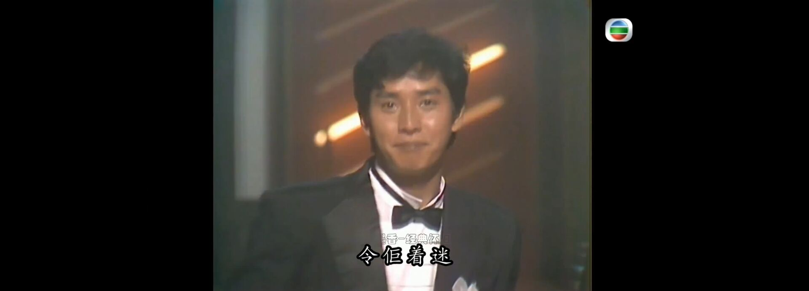

我太喜欢我这个了，少爷威威。这个造型的谭咏麟实在是，实在是。我能不能给他当女仆？妈呀这个太二次元了我这会幻想时刻了。欧秀金sama，他长得太那个风流相了把我迷得死去活来。我真的不喜欢长得好看的男人，因为我被硬控了不要他的钱那我不是傻逼吗？

我尼玛昨晚被文艺逼感染了开始感叹感情，冷静下来我只是一只发情的母智人。问我开放式关系，我昨晚被文艺逼感染了，我选择全都要好吗？我有能力为什么我不三妻四妾？但是其实我在现实里瞧不起这种人，因为饥渴成这样，给这么多人名分那也够贱的嘞，大家都知道你是个贱逼。而且说实话，要是不缺人的话，压根也不会需要好多个人一起。玩多了很boring，我喜欢一个人，就只有我一个人最好，我只把别人当工具，受不了滚蛋，我也接受别人把我当工具。我最恨的就是别人问我爱不爱，我给你一个逼兜你再问，这种问题让彼此难堪。我感觉我的自我找回来了，今天给我压抑坏了。其实我是都市情缘男主角啊。

啊哈哈我感觉我现在特别狂躁特别亢奋，哎我真的很想当男人。哎我不喜欢女人，我喜欢像女人一样的男人，但是又不能是跨性别也不能是男娘，必须认同二元性别。哎我好想认真的追求别人。如果我是富二代我将是绝杀，此等情商。我怀疑我是文艺逼之魂这会烧起来了，我在看《都市情缘》，这个男主角简直是我。哎我下辈子要当个马仔泡义嫂啊。

我突然脑子里想到一个暴论：没有比跟一个永远不会爱自己的人在一起更好的事情了，因为他永远不爱自己，婚姻的选择完全是理性的结果，他不会轻易地跑。除去感情以外的如物质之类的不可替代性只要永存，这段关系永远坚固。因为其人不爱自己，那种抓心挠肝的感觉就一直在，又因为其人在自己生活中占据着重要的社会身份，占有欲和掌控欲却能极大地满足。但是我没钱，我做不到，我的性单恋永远不能实现。因为感情基于冷漠的理性选择，不存在感情上的背叛，也不会产生各种各样的婚外情丑闻，谁也不会真正地从属谁，这不是很好吗，各取所需并且融入了彼此生命。如果我是一个太子爷我就这样对我喜欢的人，但是我没钱也没权。我惊悚地发现自己是性单恋之后有点太可怕了。

我不相信没有权力做不到的事情，只要是和社会有关系的事情，有的是驭人之术解决这些问题。权力就是话语权，足够的资源壁垒之下，何人不能成为自己的情人？哎我感觉我快疯掉了，我脑子里都是那个o娘的故事里的一个桥段：情人把o娘绑起来，让o看着他抚摸其他的女人，让她妒火中烧，再把那个在自己身下的女子赶出去扑到o身上做起爱来。我那时候看到这一段真的很触动，我算是明白为什么了。

我实在是太喜欢权力了，我要发疯了。因为爱情就不可能平等，话语权的动态博弈才带来张力。

我青春期最爱看的现代华语作家是白先勇，我这种神经质可见一斑。他是白崇禧的儿子，还是个知名同性恋。他的小说充斥着那种边缘的亚逼气息，高干爹送儿子去军营拉练培养接班人，结果儿子觉醒同性恋归来。那种家庭的苦痛、还有自我的煎熬，还有边缘人的那种心理，其实回想起来我都不知道我在看啥，我怎么会和那种角色共情。

其实这两天的事情，让我感到我离我的幸福越来越近了，但是那是我的幸福吗，我发现我压根瞒不住自己的事情，不管对方身份，我对别人都当friend结果是我把我的烂事儿全抖出去了，我不相信我会接受那种人和我搅，我这个人很神经质的，我受不的那种，不过我觉得生命真的有意思 。。

啊哈哈哈哈哈哈哈哈哈哈

其实我觉得我对人的包容度取决于对方是否有可替代性以及颜值

孩子们我对那种狗血故事没兴趣，我更在乎我啥时候能安心当nerd，在🇨🇳只有所谓人上人才是人，太奇怪了，上下两段的人都被异化，只有中间一小撮很舒服

其实我本来死了那条心，现在我又跃跃欲试了，所以我的国企太子爷男娘跨性别性少数深柜不自知建制派东方阳痿养生做题家老公在哪，我发现我没那么讨厌文艺逼小少爷了，我觉得我嘴里的少爷是个贬义词，但是没啥恶意，太子爷可能多少带点肯定，难道老天爷要赐我一个有点文艺逼属性的太子爷，不然何故让我突然去接受一个文艺逼太子，怪哉怪哉

