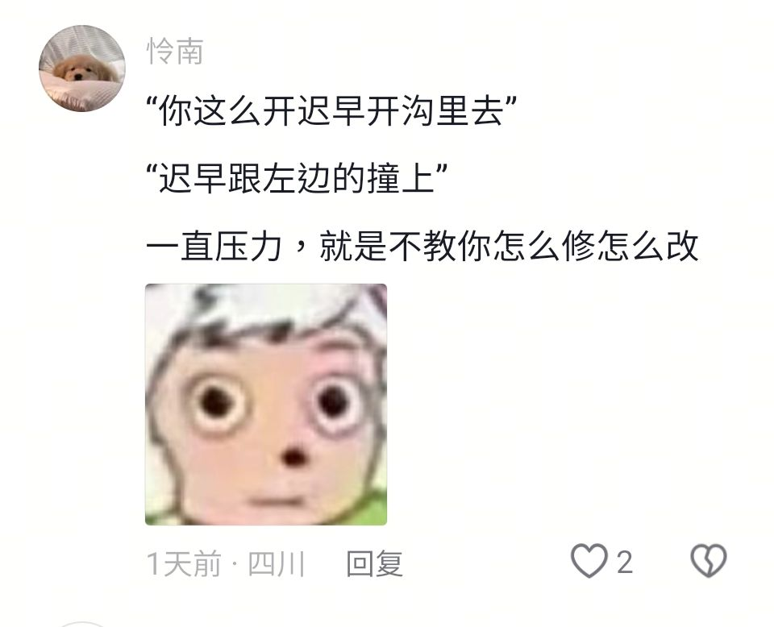

我感觉我最近英文水准变好了

我爹要也是副厅我也就幸福了。尼玛他们怎么全是二代。这个世界真的让我想想死。其实我并不是很羡慕二代的生活，他们的苦痛，我觉得我未必能接受。我一个集美是两广某副厅的孩子的，也是被收养的，也算是逆天改命了，亲生父母要毒死他，然后这两口子出手了，这姑娘因为农药后遗症神经和心脏有问题。然后就是我前面说的那个正国级二司的孙子。要去这种家庭还不如丝了。还有那种父母当官有钱但是控制欲贼强，真是特窒息。我父母控制欲强但是已经基本丧失控制我的能力了。

我还想搞个台版三星FOLD7，一看价格，NT$62,900，折合一万五人民币，心思如灰

在驾校又让教练骂，难道驾校就不用考教资吗？我真的巨讨厌他那种和我搞脾气的，搞得我一惊一乍的。最重要的是我是因为不会才来的，他怎么会指望我在路上跑两天就全会了？而且我练科三压根没有连续性的练习，他有啥错误他也不及时指出，只让我自己猜。我感觉挺窒息的，就是他表述不清楚，然后我他妈基本上就在那猜，就跟我当时学科二一样，他妈的就让我猜。

他妈的，好多东西还是我在抖音上学的，那我要你干什么？我一想到他妈的上学去再遇上个这样的学校老师，我再不求活了。对，就跟这个一样，你敢信，我他妈换档我都不知道怎么换，我他妈寻思着驾校就不用考教资吗？他妈的他说别人两天就会了，他妈的他还觉得我记忆差，那我上路我觉得害怕，本来我就没有被教多少知识。我他妈慢了，他又急，我快了，他也急，妈的根本没人跟我说哪里可以快哪里可以慢。

我想跟你分享一下我现在的想法，我现在要去浙江经贸职业技术学院读会展策划，我们学校有两个宿舍楼还没有分，不过都在校外，一个是老宿舍，7层高没有电梯，有独立洗衣机；一个是用酒店改装的宿舍，十几层楼高有电梯，但是没有独立洗衣机，都是有独立卫浴，并且有两个洗漱池的，六人寝，寝室里面有桌子，不过是大家合并在一起的那种。晚上10:30才关门禁，周末和周五晚上不管，自由出入校园。

然后我们学校有一个社团是全国百强社团，他说是公益的创业性质，但是我没太明白啥意思，叫蚂蚁微创社，每个月请一个90后CEO过来和15位学生共进午餐，自由交谈两小时，给政府还有各大高校经常做事儿，做一些力所能及的工作，如果没有这些工作的话，就在学校里帮同学。我感觉我们学校的资本主义性质真的很强，前身是改革开放时期的邓小平的左膀右臂吧，学校的校训是厚德崇商。说实话，在中国学校以赚钱为中心，真的很难见。学校里还有一个浙商文化社，学校的精神是浙商精神，我觉得这个真的挺奇葩的。

学校一共有51个社团，还有一个特殊的部门叫温暖之家，是给那些贫困生的，学校出资组织活动给这些贫困生娱乐，看电影，还有一起包饺子、做青团、做花艺等等，还有针对这些贫困生的就业指导和心理辅导，还会送生活包，里面有厚的笔记本啊，还有钥匙扣啊，还有力士的洗漱套装之类的。我感觉这个学校的管理制度也好，还是学校风格也好，真的是远超中国大部分高校。我觉得这学校不升本科是对的，难怪分数线高，本科那么多，按照甘肃可以上一本了。升本这个校风会被毙了，真的，太市场化了。

git add .
git commit -m "2025-7-31.md"
git push

